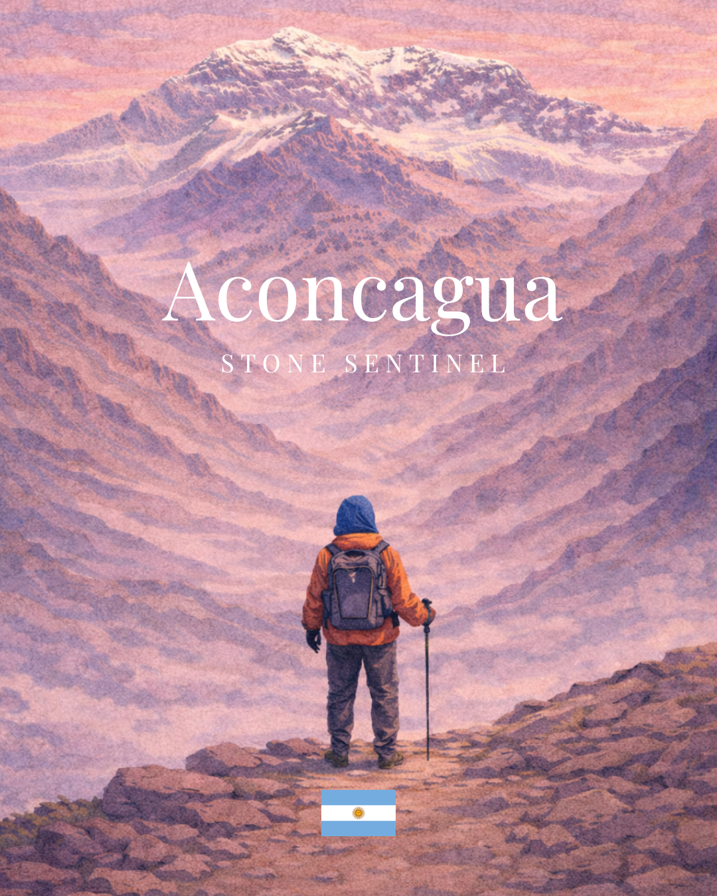
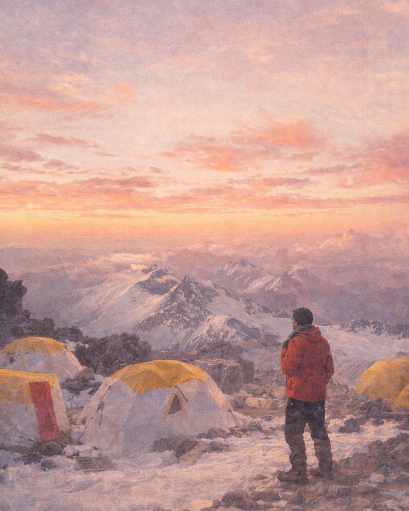
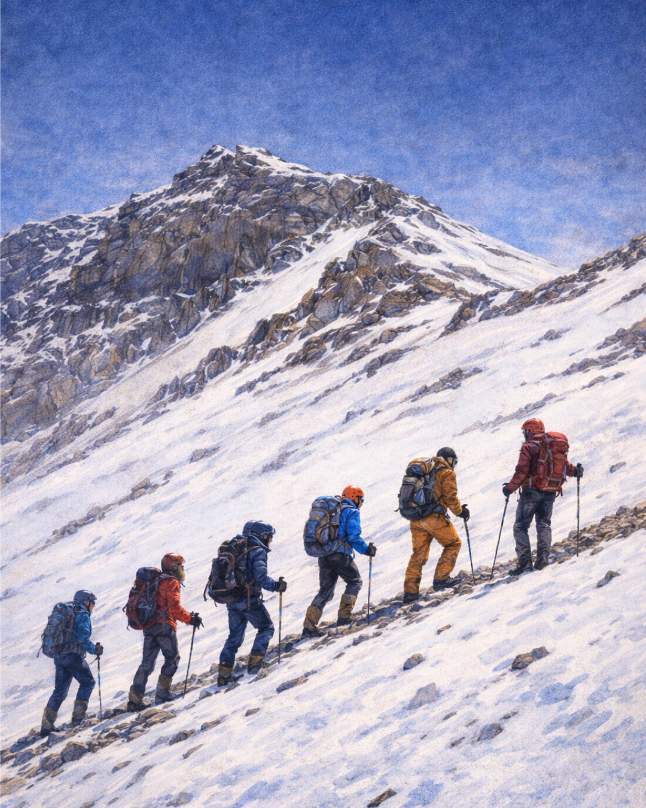

# Aconcagua: Stone Sentinel

**Un proyecto indie narrativo-sistémico sobre incertidumbre, consecuencias y esa decisión incómoda de seguir —o pegar la vuelta a tiempo.**

*Aconcagua: Stone Sentinel* es un videojuego indie single-player inspirado en el ascenso real al Cerro Aconcagua. La propuesta es lenta, deliberada y mecánicamente honesta: acá no “ganás” la montaña, aprendés a interpretarla, a negociar con ella y a aceptar que, a veces, retirarse también es jugar bien.

## Referencias visuales

La documentación ahora incorpora enlaces directos al arte disponible dentro del repositorio para facilitar la alineación entre UI, tono narrativo y construcción de personajes.

### Concepto de portada



### Vista rápida del roster de personajes

| Francisco Aguirre | Daniela De Rossi | Erik Lundvall |
|---|---|---|
|  |  |  |

### Concept art atmosférico

Una selección de la colección de 13 escenas curadas. Catálogo completo con notas de uso: [`docs/concept-art-catalog.md`](docs/concept-art-catalog.md).

| Escena 1 | Escena 3 |
|---|---|
|  |  |

| Escena 7 | Escena 13 |
|---|---|
|  |  |

**Whitepaper del proyecto**  
Este documento presenta la visión, el enfoque y las decisiones fundacionales de *Aconcagua: Stone Sentinel*.  
Es el mejor punto de entrada para entender qué tipo de juego estamos construyendo y por qué.  
→ [`/meta/project-whitepaper.md`](meta/project-whitepaper.md) (inglés)

### Whitepaper PDF

- Snapshot PDF: [`/meta/exports/project-whitepaper.pdf`](meta/exports/project-whitepaper.pdf)
- Modo de regeneración: **manual** (no se genera automáticamente por CI).
- Fuente canónica: [`/meta/project-whitepaper.md`](meta/project-whitepaper.md).
- Criterio de actualización: cada cambio en el whitepaper markdown debe incluir la regeneración y commit del PDF en el mismo PR/commit para evitar drift.

---

## Pitch en una frase

Un juego narrativo-sistémico que recrea el ascenso al Aconcagua con mecánicas centradas en realismo, donde el jugador administra cuerpo, clima y presión del entorno para decidir hasta dónde conviene llegar.

---

## Idea central

La montaña es el sistema principal y la autoridad final.

La geografía, la altitud, el clima y los límites fisiológicos condicionan cada turno. El progreso no aparece por subir un árbol de niveles ni por inflar estadísticas abstractas: aparece cuando leés señales débiles, gestionás riesgo acumulado y reconocés límites antes de que te pasen factura.

La incertidumbre, la información parcial y las consecuencias irreversibles no son decoración narrativa: son el núcleo jugable.

---

## Pilares de diseño

_Aconcagua: Stone Sentinel_ está concebido como una experiencia sistémica.

El clima, el terreno, el equipo y el estado físico y mental del jugador interactúan mediante bucles de retroalimentación que modelan el riesgo, la adaptación y la toma de decisiones.

### 1. La montaña gobierna
Altitud, terreno y clima funcionan como reglas activas. Cada acción queda condicionada por lugar y horario; el diseño prioriza geografía real por encima de coreografías de nivel abstractas.

### 2. Información parcial
El jugador accede a señales fisiológicas y ambientales mediante una interfaz diegética limitada (dispositivo tipo reloj). La certeza siempre es provisoria.

### 3. Aprender haciendo
No hay niveles RPG para grindear ni atributos milagrosos para desbloquear. La progresión surge de observar, recordar patrones y decidir bien bajo condiciones inestables.

### 4. Contemplación activa
La observación, las pausas y la lectura del entorno son mecánicas, no interrupciones. El silencio, la escala, el ritmo y el reloj también pesan en el diseño.

---

## Preparación pública y gobernanza

Para mantener el repositorio listo para revisión pública, usar esta base de gobernanza antes de abrir PRs orientados a release:

- [`docs/ai/README.md`](./docs/ai/README.md) — hub canónico de operaciones IA/agentes y mapa de documentación de skills.
- [`CONTRIBUTING.md`](./CONTRIBUTING.md) — límites de contribución, comandos de validación y puertas de CI.
- [`SECURITY.md`](./SECURITY.md) — reporte privado de vulnerabilidades y tiempos de respuesta.
- [`CODE_OF_CONDUCT.md`](./CODE_OF_CONDUCT.md) — expectativas de convivencia para la comunidad.
- [`docs/es/checklist-preparacion-publica.md`](./docs/es/checklist-preparacion-publica.md) — checklist final pre-release para coherencia de código + documentación.

---

## Lo que este juego no es

- No es un juego de acción  
- No es un simulador técnico de montañismo  
- No es una fantasía heroica  
- No es un juego de supervivencia centrado en bucles de crafteo  

El realismo se expresa a través de sistemas y mecánicas, no mediante espectacularidad técnica ni simulación excesiva.

---

## Estructura de progresión (alto nivel)

1. **Ruta Normal — Expedición asistida**  
   Introducción a los sistemas con apoyo logístico y consecuencias amortiguadas.

2. **Ascensos menos asistidos**  
   Mayor autonomía, decisiones críticas y consecuencias directas.

3. **Modo Solo — Ruta técnica extrema**  
   Autonomía total, sin asistencia ni garantías. La experiencia definitiva.

---

## Marco legal y ético

 - La geografía real del Cerro Aconcagua y sus rutas principales se representa de forma fiel.
 - No se incluyen personas reales, marcas ni entidades comerciales.
 - Los elementos históricos y culturales se tratan con un enfoque documental y no promocional.
 - No se romantiza el riesgo ni la muerte.
 - El juego no obliga al jugador a alcanzar la cumbre.
 
 Detenerse, regresar o fallar son desenlaces válidos y significativos.
 
 ---
 
 ## Estado del proyecto
 
 Este repositorio documenta los **fundamentos conceptuales y de diseño** del proyecto y contiene dos prototipos en etapas distintas de desarrollo.
 
### Prototipo activo — `prototype/web-v1/`

El prototipo web interactivo es la superficie activa de desarrollo. Implementa el engine completo de Environmental Pressure / Body Tolerance, seis personajes diferenciados, presión por permiso, ventana de decisión por tiempo, acción contextual por personaje y puente narrativo de Parte 2 con acceso condicionado por outcome y cambio de idioma en UI (inglés y español).

Jugable en la URL canónica de Vercel. Ejecutar localmente con:

```bash
python3 -m http.server 4173
# Abrir: http://localhost:4173/prototype/web-v1/
```

Ver [`prototype/web-v1/README.md`](./prototype/web-v1/README.md) para instrucciones completas.
Ver [`docs/architecture.md`](./docs/architecture.md) para el flujo del engine y mapa de datos.

### Artefacto de referencia — `prototype/mra-v0/` (congelado)

El simulador Python validó la hipótesis sistémica inicial y permanece congelado como referencia histórica.

El alcance público del repositorio es explícito:

- El código del prototipo público está disponible en este repositorio (`prototype/web-v1` activo y `prototype/mra-v0` como artefacto histórico congelado).
- El alcance de la rama de producción/comercial permanece privado.
 
 ---
 
 

## Diseño consolidado v1.4 (planificación)

Se incorporó un paquete documental de diseño/planificación v1.4 para alinear visión, estructura de juego, personajes, pipeline sistémico y fases de implementación.

- ES: [`/docs/es/diseno-consolidado-v1.4.md`](docs/es/diseno-consolidado-v1.4.md)
- EN: [`/docs/en/consolidated-design-v1.4.md`](docs/en/consolidated-design-v1.4.md)
- Plan ES: [`/docs/es/plan-implementacion-v1.4.md`](docs/es/plan-implementacion-v1.4.md)
- Plan EN: [`/docs/en/implementation-plan-v1.4.md`](docs/en/implementation-plan-v1.4.md)

> Nota: la documentación/planificación v1.4 está completamente implementada hasta v1.4.8. Para el estado actual y el mapa de módulos, ver `docs/repo-truth.md` y el bloque `[1.4.8]` del CHANGELOG.

---

## Frontends web y rutas canónicas

Este repositorio incluye una entrada pública canónica y un visor histórico archivado:

- `/` — índice canónico que ahora sirve la landing pública del proyecto con CTA principal a `prototype/web-v1/index.html`
- `prototype/web-v1/index.html` — **prototype web-v1** interactivo con mecánicas extendidas
- `prototype/mra-v0/viewer/index.html` — visor archivado para reproducir corridas del prototipo Python

Para detalles de ruteo/deploy (preview local, Vercel y CORS), usar la referencia canónica única:
- [`docs/deploy-routing.md`](./docs/deploy-routing.md)

### Corridas bundled incluidas en el visor archivado

- `narrow-weather-window-seed101-cautious`
- `false-stability-terrain-seed505-cautious`
- `accumulated-fatigue-trap-seed808-waiter`
- `late-push-seed222-cautious`
- `weather-window-seed151-cautious`

Para sesiones cualitativas, usar [`prototype/mra-v0/debrief-template.md`](./prototype/mra-v0/debrief-template.md) al cerrar cada corrida.
Guía corta recomendada para observación: [`docs/es/guia-observacion-playtest.md`](./docs/es/guia-observacion-playtest.md).


## Prototype Web v1.4 — Environmental Pressure Engine (estado público actual)

El prototipo web ahora sigue un modelo sistémico dominado por el entorno:

`ENTORNO → Presión Ambiental → Respuesta Corporal → Percepción del Jugador → Decisión del Jugador → Resultado`

Cambios centrales:

- Configuración de simulación externalizada en `/data` (`nodes.json`, `environmental_pressure_config.json`, `action_modifiers.json`, `stage_modifiers.json`).
- Cálculo de **Environmental Pressure** y **Body Tolerance** con interpretación de **Pressure Delta**.
- Overlay in-game de **Ayuda de presión y tendencia** para interpretar etiquetas de presión y categorías de tendencia sin salir de la partida.
- Modelo de nodos de ruta + modificadores por etapa, con penalización de vivac fuera de campamento después de las 22:00.
- UI de percepción (Mountain Pressure, Trend, Confidence) sin exponer al jugador valores crudos de EP/BT.
- Export de corrida por turnos como `run_log.json` desde debrief.

Ver `/docs/simulation_engine.md` para el detalle técnico.

> **Nota sobre Monte Carlo:** el simulador headless con `reasonablePolicy` sirve para detección de regresiones estructurales, no como verdad absoluta del balance jugable humano. Úsalo para detectar bloqueos (por ejemplo, 0% de cumbre generalizado) y complementalo con evidencia de playtesting humano para expectativas de win-rate.


Flujo visible actual en web-v1:

`cover de bienvenida (+ modal informativo opcional) → expedition setup → onboarding (tutorial/FAQ o comenzar) → game → (summit-success o debrief)`

La pantalla inicial ahora es deliberadamente minimalista: mantiene la cover como foco principal, deja el avance en un CTA único y mueve versión/contexto/créditos a un modal opcional para quien quiera leer más antes de empezar.

La pantalla `expedition setup` presenta dos carruseles: personaje y escenario. Cada escenario incluye sus propios modificadores de dificultad, por lo que el escenario seleccionado determina la presión ambiental, la recuperación, la economía de recursos, el margen de permiso y las ventanas de decisión — incluyendo los perfiles temporales de cada personaje y las acciones de recuperación.

La pantalla de onboarding ahora incluye un acceso a un tutorial/FAQ completo antes del CTA principal `Iniciar expedición`, con explicación del bucle de partida, sistemas ocultos, referencia de acciones, comportamiento de la dificultad y preguntas frecuentes de reglas.

La selección de personaje ahora incluye una opción `Random Character` que elige automáticamente uno de los seis perfiles disponibles al confirmar la expedición.

Estado de Parte 2 (v1.4):

`part2-character → mendoza_room → team_presentation → after_circle → guides → briefing_night → departure_road → future_cta`

Vista previa narrativa: 7 pantallas de historia totalmente jugables con Francisco después de un regreso desde cumbre. Las mecánicas completas de expedición de la Parte 2 quedan diferidas.

El unlock sigue siendo exclusivo de `Summit and Safe Return`.

### Deep-link URLs

Cada pantalla del prototipo es accesible directamente mediante una URL basada en hash. Después de cargar los datos, `handleDeepLink()` lee `window.location.hash` y navega en consecuencia. La navegación normal dentro de la app mantiene el hash sincronizado, por lo que cualquier pantalla es compartible.

Formato: `https://aconcagua-stone-sentinel.vercel.app/prototype/web-v1/index.html#<screenId>[&param=valor…]`

Ejemplos:

```
#title
#expedition-setup
#game&character=francisco&scenario=assisted-route&seed=1234
#onboarding&character=laura&scenario=narrow-weather-window
#debrief&outcome=Collapse%20(Fatigue)
#summit-success
#part2-character&force=1
```

Tabla completa con todas las pantallas activas, referencia de parámetros, IDs de personajes/escenarios/outcomes y links listos para copiar: [`docs/deep-links.web-v1.md`](./docs/deep-links.web-v1.md).

## Estructura del repositorio
 
 - [`/docs`](./docs) — Documentos conceptuales, pilares de diseño, visión de sistemas (inglés y español) y propuesta de artefacto mínimo reproducible (solo en inglés).
 - [`/art`](./art) — Concept art curado y referencias visuales
 - [`/devlog`](./devlog) — Intención de diseño, decisiones de alcance y reflexiones
 - [`/meta`](./meta) — Roadmap público, whitepaper y notas de visibilidad
 
 ---
 
 ## Política de idioma
 
 - El inglés es el idioma canónico del proyecto.
 - La documentación en español se ofrece como capa paralela y contextual.
 
 Ver [`README.md`](./README.md) para la versión en inglés.
 
 ---
 
 ## Licencia
 
 Este proyecto se distribuye bajo la licencia  
 **Creative Commons Atribución–NoComercial–SinDerivadas 4.0 Internacional (CC BY-NC-ND 4.0).**
 
 Se permite leer, compartir y referenciar el contenido de este repositorio con fines no comerciales.
 
 No está permitido reutilizar, modificar, redistribuir ni comercializar ninguna parte del proyecto —incluyendo su concepto, documentación o arte— sin autorización explícita.
 
 Para más detalles, ver [`LICENSE.md`](./LICENSE.md).

---

## Contacto

Para consultas profesionales, conversaciones curatoriales o propuestas de colaboración:

**Ernesto Gallegos**  
Creador del proyecto  
aconcaguastonesentinel@gmail.com

---

*Aconcagua: Stone Sentinel explora la idea de que avanzar no siempre significa progresar, y que reconocer los límites —externos e internos— puede ser una forma de éxito.*


## Estado canónico del prototipo (v1.4.8 estado público)

> **Estado canónico (anclado al código):**
> - El estado de implementación se rastrea en `CHANGELOG.md` bajo [`[1.4.8]`](./CHANGELOG.md).
> - El progreso por fase se rastrea en [`docs/es/plan-implementacion-v1.4.md`](./docs/es/plan-implementacion-v1.4.md) (versión en inglés: `docs/en/implementation-plan-v1.4.md`).
> - La versión pública actual es **v1.4.8**.

El prototipo activo canónico es **`prototype/web-v1` (v1.4.8 estado público)**.

- `prototype/web-v1/`: prototipo sistémico activo, ruta nodo a nodo, engine EP/BT/delta, y mecánicas v1.4.8 modulares en despliegue público.
  - Los contratos de arranque son estrictos: los archivos de modelo requeridos deben cargar y validar antes de jugar; los fallos bloqueantes muestran archivo/categoría de diagnóstico.
  - La orquestación de turnos es responsabilidad de `ui/game-loop.js` (factory `createGameLoop(deps)`) con callbacks de renderizado inyectados.
  - El flujo de pantallas y modales es responsabilidad de `ui/flow-controller.js` (`initFlowController(hooks)`).
  - Las funciones de análisis de debrief (`findTurningPoint`, `findPrimaryCause`, `buildReflectionPrompts`) están extraídas en `ui/screens/debrief.js` como funciones puras.
  - Las funciones utilitarias están en `ui/helpers/screen-utils.js`.
- `prototype/mra-v0/`: MRA histórico congelado para validación temprana de hipótesis.
- Visor archivado MRA v0 (`prototype/mra-v0/viewer`): capa de reproducción de corridas bundleadas.

Ver `docs/architecture.md` y `docs/simulation_engine.md` para contratos técnicos, y `docs/repo-truth.md` para la verdad canónica del repositorio.
