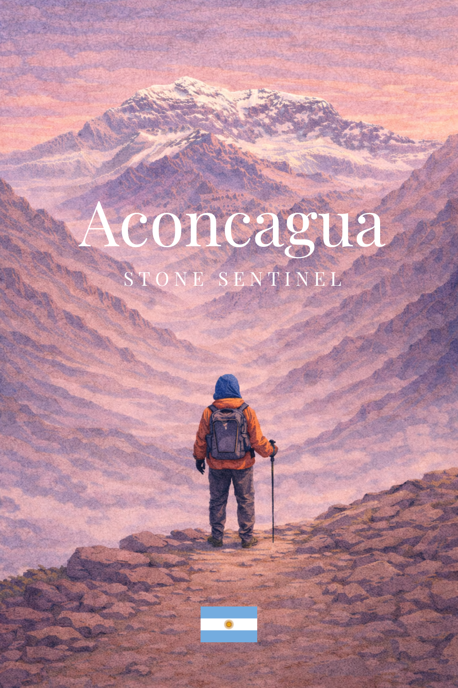
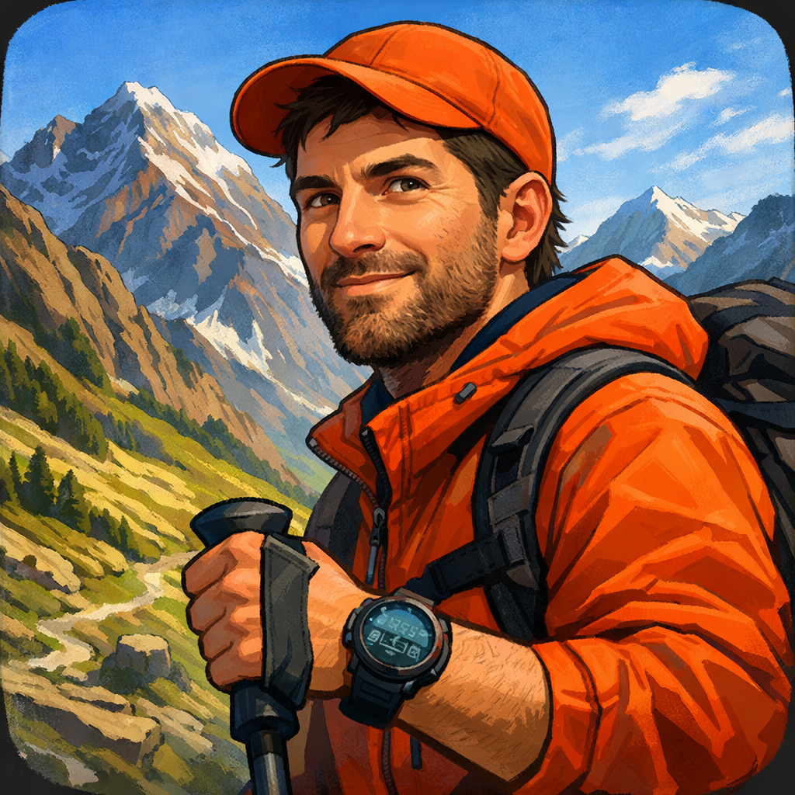

# Aconcagua: Stone Sentinel

**A narrative–systemic indie game about limits, environment, and the decision to continue.**

*Aconcagua: Stone Sentinel* is an indie, single-player game inspired by the real ascent of Mount Aconcagua. It proposes a slow, deliberate, and systems-driven experience in which the player does not conquer the mountain, but learns to read it, adapt to it, and decide when advancing is no longer the right choice.

Reaching the summit is only one of several valid outcomes.

## Visual references

Repository documentation now includes direct links to current in-repo artwork so contributors can quickly align UI, narrative tone, and character identity.

### Cover concept



### Character roster preview

| Francisco Aguirre | Daniela De Rossi | Erik Lundvall |
|---|---|---|
|  |  |  |

### Atmospheric concept art


---

**Project Whitepaper**  
Start here to understand the vision and design rationale behind *Aconcagua: Stone Sentinel*:  
→ [`/meta/project-whitepaper.md`](meta/project-whitepaper.md)

### Whitepaper PDF

- PDF snapshot: [`/meta/exports/project-whitepaper.pdf`](meta/exports/project-whitepaper.pdf)
- Regeneration mode: **manual** (it is not auto-generated by CI).
- Canonical source: [`/meta/project-whitepaper.md`](meta/project-whitepaper.md).
- Update criterion: whenever the whitepaper markdown changes, regenerate and commit the PDF in the same PR/commit to avoid drift.

---

## One-Sentence Pitch

A narrative and systemic indie game that recreates the ascent of Aconcagua through realism-driven mechanics, where the player manages body, climate, and environment to decide how far to go.

---

## Core Idea

The mountain is the central system and the highest authority.

Geography, altitude, weather, and physical limits actively shape every decision. Progress does not emerge from leveling up or acquiring abstract attributes, but from learning how to interpret signals, manage risk, and recognize boundaries.

Uncertainty, partial information, and irreversible consequences are core elements of the experience.

---

## Design Pillars

_Aconcagua: Stone Sentinel_ is designed as a systemic experience.

Climate, terrain, equipment and the player’s physical and mental condition interact through feedback loops, shaping risk, adaptation and decision-making over time.

### 1. The Mountain Governs
Altitude, terrain, and climate are active systems that condition every action. The game design adapts to real geography rather than abstract level design.

### 2. Partial Information
The player accesses physiological and environmental data through a limited, diegetic interface (a watch-like device). Certainty is never absolute.

### 3. Learning by Doing
There are no levels or character attributes. Progression emerges from observation, experience, and informed decision-making under changing conditions.

### 4. Active Contemplation
Observation, pauses, and environmental awareness are not interruptions but core mechanics. Silence, scale, and time are meaningful design elements.

---

## Public-readiness and governance

To keep this repository ready for public review, use the following baseline governance docs before opening release-oriented PRs:

- [`CONTRIBUTING.md`](./CONTRIBUTING.md) — contribution boundaries, validation commands, and CI gates.
- [`SECURITY.md`](./SECURITY.md) — private vulnerability reporting and response targets.
- [`CODE_OF_CONDUCT.md`](./CODE_OF_CONDUCT.md) — community behavior expectations.
- [`docs/en/public-readiness-checklist.md`](./docs/en/public-readiness-checklist.md) — final pre-release checklist for code + docs coherence.

---

## What This Game Is Not

- Not an action game  
- Not a technical mountaineering simulator  
- Not a heroic power fantasy  
- Not a survival game focused on crafting loops  

Realism is expressed through systems and mechanics, not through technical spectacle or excessive simulation.

---

## High-Level Progression Structure

1. **Normal Route — Assisted Expedition**  
   Introduction to systems with logistical support and buffered consequences.

2. **Less Assisted Ascents**  
   Increased autonomy, critical decisions, and direct consequences.

3. **Solo Mode — Extreme Technical Route**  
   Full autonomy, no assistance, and no guarantees. The definitive experience.

---

## Legal and Ethical Framework

- The real geography of Mount Aconcagua and its main routes is represented faithfully.
- No real people, brands, or commercial entities are depicted.
- Historical and cultural elements are treated with a documentary, non-promotional approach.
- Risk and death are not romanticized.
- The game does not force the player to reach the summit.

Turning back, stopping, or failing are valid and meaningful outcomes.

---

## Project Status

This repository documents the **conceptual and design foundations** of the project and contains two prototypes at different stages of development.

### Active prototype — `prototype/web-v1/`

The interactive web prototype is the current development surface. It implements the full
Environmental Pressure / Body Tolerance simulation engine, a diegetic clock, five player
actions plus a character-specific contextual action, fifteen named route nodes, multilingual UI switching (English and Spanish), an
acclimatization subsystem, six differentiated characters, stage-based modifiers, permit
pressure, decision-window timing pressure, and multiple run archetypes.

Playable at the canonical Vercel URL. Run locally with:

```bash
python3 -m http.server 4173
# Open: http://localhost:4173/prototype/web-v1/
```

See [`prototype/web-v1/README.md`](./prototype/web-v1/README.md) for full instructions.
See [`docs/architecture.md`](./docs/architecture.md) for the engine flow and data source map.
See [`docs/repo-truth.md`](./docs/repo-truth.md) for the canonical live/frozen/version/roster truth contract.

### Reference artifact — `prototype/mra-v0/` (frozen)

The Python simulator validated the core design hypothesis and is now frozen.
It will not receive new mechanics. See [`devlog/005-prototype-architecture.md`](./devlog/005-prototype-architecture.md) for the architectural decision record.

Public repository scope is explicit:

- Public prototype code is available in this repository (active `prototype/web-v1` plus frozen `prototype/mra-v0` reference artifact).
- Production/commercial branch scope remains private.

---


## Web frontends and canonical routes

This repository includes one canonical public entry point and one archived viewer:

- **Canonical index (`/`)**: now serves the public project landing page with a primary CTA to `prototype/web-v1/index.html`.
- **Prototype web-v1 (`prototype/web-v1/index.html`)**: interactive vertical slice with expanded mechanics.
- **Archived MRA v0 viewer (`prototype/mra-v0/viewer/index.html`)**: legacy replay interface for bundled Python prototype runs.

For deploy/local routing details (including Vercel settings and CORS), use the single canonical reference:
- [`docs/deploy-routing.md`](./docs/deploy-routing.md)
- [`docs/TROUBLESHOOTING.md`](./docs/TROUBLESHOOTING.md) for startup/runtime diagnostics and common operator recovery steps.
- [`docs/context-events-guide.md`](./docs/context-events-guide.md) for the context-event contract and engine authority boundaries.

### Bundled runs currently committed (archived viewer)

- `narrow-weather-window-seed101-cautious`
- `false-stability-terrain-seed505-cautious`
- `accumulated-fatigue-trap-seed808-waiter`
- `late-push-seed222-cautious`
- `weather-window-seed151-cautious`

For qualitative sessions, use [`prototype/mra-v0/debrief-template.md`](./prototype/mra-v0/debrief-template.md) immediately after each run.
Short observation companion: [`docs/es/guia-observacion-playtest.md`](./docs/es/guia-observacion-playtest.md).


## Prototype Web v1.4 — Environmental Pressure Engine (current public implementation)

The web prototype follows a unified environmental-dominance resolution pipeline:

`normalize action → resources/time → weather+persistence → Environmental Pressure (EP) + Body Tolerance (BT) → perception/timing effects → outcome evaluation → state update → terminal classification`

All simulation parameters are loaded from `/data`:

- `nodes.json` — 15 named route nodes with altitude band, terrain, weather, and camp flags
- `environmental_pressure_config.json` — EP scale values, resource burn rates, bivouac penalties
- `action_modifiers.json` — per-action fatigue/exposure/progress multipliers
- `stage_modifiers.json` — APPROACH / HIGH_CAMP / SUMMIT_DAY multipliers
- `characters.json` — six characters with engine-level differentiation (`difficultyLabel`, decision-window profiles, and perception-latency guardrails)
- `outcomes.json` — canonical outcome taxonomy

Current visible flow in web-v1 is:

`welcome cover (+ optional info modal) → expedition setup → onboarding (tutorial/FAQ or begin) → game → (summit-success or debrief)`

The welcome screen is now intentionally minimal: the cover art remains dominant, the main CTA advances directly into expedition setup, and version/context/credits live inside an optional info modal for players who want extra reading before starting.

The expedition-setup screen presents two carousels: character and scenario. Each scenario embeds its own difficulty modifiers, so the selected scenario determines pressure, recovery, resource economy, permit slack, and decision-window leniency for the run — including character-specific timer profiles and signed recovery actions.

The onboarding screen now includes a full tutorial/FAQ entry point before `Understood. Begin.`, covering the run loop, hidden systems, action reference, difficulty behavior, and common rules questions.

Character selection now includes a `Random Character` option that auto-picks one of the six available profiles when you confirm the expedition.

Part 2 remains a gated narrative bridge (not yet playable expedition gameplay):

`part2-character → part2-hotel → part2-intro → part2-guides → part2-transfer → part2-closure`

Unlock is exclusive to `Summit and Safe Return`.

See `docs/simulation_engine.md` and `docs/architecture.md` for full mechanics.

### Deep-link URLs

Every screen in the prototype is directly accessible via a hash-based URL. After data loads, `handleDeepLink()` reads `window.location.hash` and navigates accordingly. In-app navigation keeps the hash in sync so any screen is shareable.

Format: `https://aconcagua-stone-sentinel.vercel.app/prototype/web-v1/index.html#<screenId>[&param=value…]`

Examples:

```
#title
#expedition-setup
#game&character=francisco&scenario=assisted-route&seed=1234
#onboarding&character=laura&scenario=narrow-weather-window
#debrief&outcome=Collapse%20(Fatigue)
#summit-success
#part2-character&force=1
```

Full table with all 14 screens, parameter reference, character/scenario/outcome IDs, and copy-pasteable links: [`docs/deep-links.web-v1.md`](./docs/deep-links.web-v1.md).


## Consolidated design v1.4 (planning)

A v1.4 design/planning documentation package was added to align vision, game structure, characters, systemic pipeline, and implementation phases.

- ES: [`/docs/es/diseno-consolidado-v1.4.md`](docs/es/diseno-consolidado-v1.4.md)
- EN: [`/docs/en/consolidated-design-v1.4.md`](docs/en/consolidated-design-v1.4.md)
- Plan ES: [`/docs/es/plan-implementacion-v1.4.md`](docs/es/plan-implementacion-v1.4.md)
- Plan EN: [`/docs/en/implementation-plan-v1.4.md`](docs/en/implementation-plan-v1.4.md)

> Note: v1.4 documentation and planning are now partially implemented in the current public prototype. Check the changelog `1.4.5` release block and implementation plan files for latest phase progress.


## Repository Structure

- [`/docs`](./docs) — Concept documents, design pillars, system overviews, and a minimal reproducible artifact proposal
- [`/art`](./art) — Curated concept art and visual references
- [`/devlog`](./devlog) — Design intent, scope decisions, and reflections
- [`/meta`](./meta) — Public roadmap, whitepaper and visibility notes

---

## Language Policy

- English is the canonical language of the project.
- Spanish documentation is provided as a parallel, contextual layer.

See [`README.es.md`](./README.es.md) for the Spanish version.

---

## License

This project is licensed under the  
**Creative Commons Attribution–NonCommercial–NoDerivatives 4.0 International License (CC BY-NC-ND 4.0).**

You are free to read, share, and reference the contents of this repository for non-commercial purposes.

You may not reuse, modify, redistribute, or commercialize any part of this project—including its concept, documentation, or artwork—without explicit permission.

For full details, see [`LICENSE.md`](./LICENSE.md).

---

## Contact

For professional inquiries, curatorial conversations, or collaboration proposals:

**Ernesto Gallegos**  
Project creator  
aconcaguastonesentinel@gmail.com

---

*Aconcagua: Stone Sentinel explores the idea that advancing does not always mean progressing, and that recognizing limits—external and internal—can be a form of success.*


## Prototype canonical status (v1.4.5 public state)

> **Canonical status (source-anchored):**
> - Live implementation status is tracked in `CHANGELOG.md` under [`[1.4.5]`](./CHANGELOG.md#145--2026-03).
> - Phase progress snapshot is tracked in [`docs/en/implementation-plan-v1.4.md`](./docs/en/implementation-plan-v1.4.md) (Spanish mirror: `docs/es/plan-implementacion-v1.4.md`).
> - Current public build is **v1.4.5 (public phased rollout)**.

The canonical active prototype is **`prototype/web-v1` (v1.4.5 public state)**.

- `prototype/web-v1/`: active systemic prototype, node-to-node route, EP/BT/delta engine, and v1.4.5 phased mechanics currently in public rollout.
  - Startup contracts are strict: required model files must load and validate before play; blocking failures are rendered with file/category diagnostics.
- `prototype/mra-v0/`: frozen historical MRA used for early hypothesis validation.
- archived MRA v0 viewer (`prototype/mra-v0/viewer`): replay/view layer for bundled runs.

See `docs/architecture.md` and `docs/simulation_engine.md` for technical contracts, and `docs/repo-truth.md` for canonical repo truth parity.
