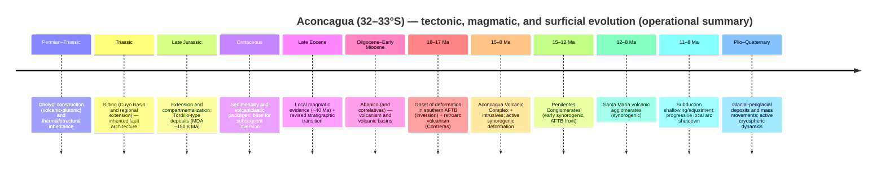

# Aconcagua Geological Bible for Aconcagua: Stone Sentinel

**Repository / file:** `geological-bible-aconcagua.md`  
**Project:** *Aconcagua: Stone Sentinel*  
**Version:** 1.0 (definitive-operational)  
**Last updated:** 2026-04-14 (America/Argentina/Buenos_Aires)  
**Spatial scope (ROI):** ~32°–33°S and 70°25′–69°W (Cordillera Principal–Cordillera Frontal–Precordillera), focused on the **Aconcagua massif and peak**. <!-- citeturn8view2 -->  
**Reference elevation (Aconcagua summit):** 6960.8 m a.s.l. (SIGMA Program, 2011–2012 measurements, IGN) and IGN listing 6961 m (rounded). <!-- citeturn20search0turn20search2 -->  
**Unspecified constraints:** *no specific constraint* (e.g., final asset graphic licenses to be incorporated into the repo, target scale for internal "exportable" cartography, project color standard).

## Executive summary

Cerro Aconcagua (Cordillera Principal, Mendoza) sits at a key sector of the southern Central Andes: the transition between Pampean subhorizontal subduction (to the N) and "normal" subduction (to the S), with direct effects on the style of crustal deformation, arc magmatism migration, and the shutdown of volcanism toward the late Miocene. <!-- citeturn6search0turn6search1turn45view0turn7view1 -->

From a lithological standpoint, Aconcagua is the remnant of a **Miocene composite stratovolcano** (breccias, andesites, dacites, and tuffs) grouped within the **Aconcagua Volcanic Complex (AVC)**, exhibiting an architecture of a "lower section" (~13.7–11.3 Ma) and an "upper section" (~11.1–9.6 Ma) separated by an angular unconformity; the record also includes associated intrusives and dikes, as well as an early granodioritic pluton (Matienzo Granodiorite, ~21.6 Ma). <!-- citeturn46view0turn7view0turn34view0 -->

Structurally, the area forms part of the **Aconcagua Fold-and-Thrust Belt (AFTB)**, with mixed **thin-skinned** (detachments along weak Mesozoic levels, including evaporites where present) and **thick-skinned** (inversion of inherited extensional structures and basement involvement) participation. Published section balances for the 33°30′–33°45′S sector propose shortening on the order of several tens of km (e.g., ~47 km in a representative cross-section of the southern AFTB), with temporal migration of the deformation front and out-of-sequence episodes. <!-- citeturn17view0turn45view0turn6search7turn38view0 -->

At the surface, geomorphology is dominated by Quaternary glacial–periglacial sculpting (Horcones and Vacas valleys, moraines, debris-covered glaciers, and rock glaciers, thermokarst), with **first-order geological hazards** for operations and narrative: mass movements (rockfalls, debris flows, landslides), collapses/mega-landslides linked to the south face, and dynamic glacier behavior (surges and thermokarst) with potential downstream impacts. <!-- citeturn27view0turn26view0turn30view0turn29view0turn28view0 -->

For the *Stone Sentinel* project, this translates into a clear set of visual and physical "drivers": alternating tilted and altered volcaniclastic packages, resistant intrusives that control ridges and "hogbacks," thrust structures (Penitentes/Santa María fronts in the corridor), and an active cryogenic landscape (debris-covered glaciers, talus, alluvial fans, and mass-movement scars), all anchored in open DEM/satellite data (Copernicus DEM, SRTM, AW3D30, Sentinel-2). <!-- citeturn21search0turn21search1turn21search2turn21search3turn21search4turn30view0 -->

## Introduction

This document consolidates a unique technical baseline ("geological bible") to describe and operate with Aconcagua's geology within the project repository, prioritizing: (i) stratigraphic and tectonic coherence, (ii) traceability to primary maps and literature, (iii) parameters usable in 3D modeling/visualization and worldbuilding, and (iv) a pragmatic inventory of geological hazards relevant to logistics in the Andean corridor.

The area of interest is restricted to ~32°–33°S and 70°25′–69°W, including Aconcagua Provincial Park and the Las Cuevas–Horcones–Vacas–Punta de Vacas–Polvaredas–Uspallata corridor (as an operational frame). <!-- citeturn27view0turn22view0 -->

### Methodology and sources

A synthesis methodology with hierarchy of evidence was followed:

First, the monograph **Ramos et al. (1996)** (Anales 24) and its thematic chapters (stratigraphy, structure, volcanism, geomorphology) were adopted as the backbone. <!-- citeturn5search5turn33view0 -->  
Then, 1996–2026 updates were incorporated with a focus on: (a) **chronostratigraphic reassignments and new U-Pb/Ar-Ar ages** and reinterpretations of key units (e.g., río Cuevas section), (b) **tectonic syntheses** on AFTB and Cordillera Frontal style/timing, (c) **applied geoscience** for hazards (inventories, DInSAR, Quaternary geochronology) and the cryosphere (National Glacier Inventory, thermokarst, surges). <!-- citeturn7view1turn34view0turn45view0turn28view0turn30view0turn29view0 -->

Spanish-language sources were prioritized where available (RAGA, SciELO Argentina, SEGEMAR, IGN, IANIGLA) alongside recent peer-reviewed publications (Frontiers 2023/2025, EPSL 2022, Scientific Reports 2019, Nature Communications 2026). <!-- citeturn45view0turn7view1turn34view0turn38view0turn39view0turn28view0 -->

**Limitations (explicit):** some of the large PDFs from SEGEMAR's DSpace repository (maps and memoirs) timed out from the extraction environment; official references and links to the parent item are included where accessible, with explicit notes when full content could not be inspected. <!-- citeturn12view0turn8view2 -->

**Databases and catalogs (for expansion and audit):**  
- GeoRef (AGI) for bibliography, maps, and theses. <!-- citeturn25search2 -->  
- EarthChem Portal and GEOROC for geochemistry, isotopes, and published analytical ages. <!-- citeturn25search0turn25search1turn25search4turn25search9 -->  
- National repositories (Exactas-UBA, CONICET Digital) for theses and localized grey literature. <!-- citeturn25search3turn44search2turn41search12 -->

**Cartographic conventions (recommended for the repo):** WGS84 geographic and UTM Zone 19S (EPSG:32719) for operational layers; elevations in m a.s.l.; ages in Ma. *(If the project adopts POSGAR/GK, fix the version and zone in a `README_GIS.md` in the repo.)*

## Regional Andean geological framework

### Geodynamic context

Aconcagua lies in a segment of the Central Andes where the Nazca–South America interaction displays strong latitudinal segmentation. Between ~27° and ~33.5°S, Pampean subduction is characterized by a subhorizontal slab segment associated, among other factors, with the interaction with the Juan Fernández Ridge and slab coupling/structure patterns that influence volcanism and deformation. <!-- citeturn6search0turn6search1turn6search11turn6search2turn6search12turn6search16 -->

Around 33°–34°S a **transition zone** develops: to the south an active volcanic arc is recorded (from Tupungato southward), whereas to the north modern volcanism diminishes/ceases, linked to the late Miocene arc shutdown driven by slab shallowing. <!-- citeturn45view0turn7view1turn6search1turn39view0 -->

### Geological provinces within the ROI

In morphostructural and geological terms, the 32°–33°S and 70°25′–69°W clip includes (from W to E, simplified):

- **Cordillera Principal (CP):** Mesozoic and Cenozoic sequences (sedimentary, volcanic, and volcaniclastic) and the core of the **Aconcagua Fold-and-Thrust Belt**; this is where the Miocene volcanic edifice of Aconcagua is emplaced. <!-- citeturn7view1turn46view0turn27view0 -->
- **Cordillera Frontal (CF):** uplifted basement block (with highly representative Choiyoi) and structures that, depending on models, experienced early exhumation (from ~20 Ma onward) or dominant uplift from ~9–6 Ma in classical models; the vergence and timing debate is central to the state of the art. <!-- citeturn38view0turn45view0turn31view0 -->
- **Precordillera (PC) (eastern margin of the clip):** appears at the eastern extreme of the ROI (to 69°W), relevant for metallogeny and foreland (per sheet 3369-I). <!-- citeturn8view2 -->

### Recommended regional maps and data

1) **SEGEMAR Repository – Anales 24 (Ramos et al., 1996)**: basis for unit names and the regional stratigraphic/structural framework. <!-- citeturn5search5turn33view0 -->  
2) **SEGEMAR maps and datasets** (when geophysical/DEM/aerogamma layers are needed): Sheet 3369-I *Geophysical Map* (DTM, magnetometry, gamma-ray radiometry; 1:250,000 scale). *(Item accessible; sub-PDF downloads may fail depending on environment.)* <!-- citeturn12view0 -->  
3) **SIGAM/GeoNetwork SEGEMAR**: Quaternary and deformation layers at 250K, useful for regional neotectonics (linked from recent bibliographies). <!-- citeturn22view0 -->

## Stratigraphy, magmatism, and geochronology

### Operational principle

For the project it is convenient to handle two simultaneous levels:

- **Level A (operational/visual):** packages of "Choiyoi basement" + "Mesozoic sedimentary/volcaniclastic" + "Cenozoic volcanic-Miocene" + "Quaternary surficial."  
- **Level B (strict geological):** formations by name and age (including recent U-Pb/Ar-Ar revisions that reassign units historically attributed to the Cretaceous).

The río Cuevas section and surroundings have undergone important revisions: U-Pb ages and stratigraphic reinterpretations suggest that several volcanic bodies previously mapped as "Cretaceous" in the classical framework correspond to late Paleogene–Miocene volcanism (Abanico/Farellones) and/or to Miocene pulses linked to the Aconcagua Volcanic Complex itself. <!-- citeturn7view1turn32view3 -->

### Synthetic lithostratigraphic column (ROI 32–33°S)

> **Recommended usage:** adopt this table as the master unit dictionary (`/docs/geologia/unidades.yml`) for labeling meshes, textures, and assets.

| Package | Units / groups (dominant examples in the ROI) | Age (approx.) | Lithology / features | Setting / significance | Useful visual cues (modeling) |
|---|---|---:|---|---|---|
| Basement | Lower Paleozoic metamorphic and sedimentary rocks + mafic-ultramafic belt (complex) reported at sheet 3369-I scale | Early Paleozoic–Lower Paleozoic | Metasedimentites, metavolcanics, mafic/ultramafic bodies | Pre-Andean basement; structural inheritance | Dark outcrops, banding, resistant ridges (where exposed) |
| Late Gondwanan | Gondwanan orogeny (pre-Permian structuring) | Late Paleozoic | Deformation + intrusives | Preconditions anisotropies | Inherited foliations/lineations |
| Choiyoi Magmatic Province | **Choiyoi Group** (Permo-Triassic volcanics and plutonics) | ~Permian–Early Triassic | Rhyolites/dacites/andesites + granites; large volume | Post-Gondwanan arc/extension | Light-reddish tones, ignimbrites, massive flows; mesas and cliff faces |
| Cuyo Rift (extension) | Triassic volcano-sedimentary sequence in rift basins (Precordillera) | Triassic | Clastics + subordinate basalts | Rifting; controls inherited faults | Red beds, medium to coarse, half-graben geometries |
| Mesozoic (CP) | Jurassic–Cretaceous sequences: limestones (e.g., La Manga), red beds (Tordillo), Cretaceous units (Diamante and equivalents), and volcanic/volcaniclastic packages (historically "Juncal" on classical maps, now partially revised) | Jurassic–Cretaceous | Carbonates + red clastics + volcaniclastics | Intra-arc/retroarc basins and transition to inversion | Limestone–red–volcanic alternation; steeply dipping strata in the belt |
| Late Paleogene–Early Miocene (Chile/boundary ridge) | **Abanico** (tuffs, breccias, lavas, lacustrine) and **Farellones** (Miocene volcanism) in western CP; correlations and ages refined by U-Pb/Ar-Ar | Oligocene–Early Miocene | Volcanic-volcaniclastic | Volcanic basin evolution and inversion | Green/grey colors, breccias; thick volcanic packages |
| Miocene (Aconcagua) | **Aconcagua Volcanic Complex** + associated intrusives (veins, dikes, porphyries) | ~15.8–8 Ma (with cores at 13.7–11.3 / 11.1–9.6) | Andesites, dacites, breccias, tuffs; intrusives | Expanded arc / inboard migration | Tilted volcaniclastic strata, argillic alteration, resistant dikes |
| Miocene synorogenic (AFTB front) | Penitentes Conglomerates (15–12 Ma) and Santa María volcanic agglomerates (12–8 Ma) as synorogenic fill (per recent synthesis) | Middle–Late Miocene | Conglomerates, debris flows, volcaniclastics | Direct record of deformation and erosion | Cones, thick beds, visible unconformities |
| Plio–Quaternary | Glacial, fluvial, alluvial, colluvial deposits; local caliches; mass-movement deposits | Plio–Holocene | Unconsolidated to semi-consolidated material | Recent landscape shaping; hazards | Moraines, fans, colluvium, scars, and chaotic deposits |

**Key stratigraphic revision notes**  
- In the 32°50′S clip, U-Pb ages and new mapping suggest: (i) the "Vargas Volcanics" belong to the basal segment of the Diamante; (ii) "Laguna Seca Volcanics" may be a distinct, younger informal unit; (iii) packages assigned to Vaca Muerta/Mulichinco/Agrio in historical mapping may correspond to younger units (Saldeño–Pircala–Coihueco) in certain sectors; (iv) part of what was mapped as "Juncal" includes late Miocene volcanism in recent interpretations (cited as an active line of research). <!-- citeturn32view3turn7view1 -->

### Geochronology and reference ages (comparative table)

> **Recommended usage:** this table should be exported to a versioned CSV (`/data/geocronologia/aconcagua_geocron.csv`) for traceability and for an automated "timeline" in the project engine.

| Material / unit | Locality / reference | Method | Age (Ma) | Operational comment |
|---|---|---|---:|---|
| Matienzo Granodiorite | Quebrada Benjamín Matienzo (Cuevas area) | K/Ar (biotite) | 21.6 ± 1.0 | Early intrusive; magmatic anchor predating the main edifice. <!-- citeturn46view0turn7view0 --> |
| Host rock Q. Matienzo | Matienzo | K/Ar | 20.9 ± 3.0 | Broad age; use as guidance, not as a sole marker. <!-- citeturn46view0 --> |
| Eastern Tolosa dike | Tolosa | K/Ar (plagioclase) | 14.3 ± 1.0 | Signals early-to-middle Miocene magmatic phase preceding/early in the AVC. <!-- citeturn46view0 --> |
| Plaza de Mulas dacite | Plaza de Mulas | K/Ar | 13.7 ± 1.8 | Compatible with the AVC "lower section." <!-- citeturn46view0turn7view0 --> |
| Dacite (4250 m) | High flank | K/Ar | 15.8 ± 0.4 | Inferred oldest minimum age for the Aconcagua volcanic sequence. <!-- citeturn46view0turn7view0 --> |
| Andesites/dacites (lower section) | Various (Berlín/Plaza de Mulas/Plataforma) | K/Ar | ~11.3–13.7 | Lower sequence: lavas/breccias/tuffs; frequent alteration. <!-- citeturn46view0turn7view0 --> |
| Summit andesite (AC-2) | Summit | K/Ar (hornblende) | 9.63 ± 0.44 | Indicator of the "upper section" (summit). <!-- citeturn46view0turn7view0 --> |
| Canaleta andesite | ~6800 m | K/Ar | 8.9 ± 0.5 | Interpreted as a late dike/activity intruding the summit. <!-- citeturn46view0 --> |
| Santa María Conglomerate tuffs | Santa María (synorogenic) | K/Ar | 8.1 ± 0.6 | Direct relationship with synorogenic fill and volcanism. <!-- citeturn46view0turn34view0 --> |
| SMC (ashes) | Santa María Conglomerate (SMC) | U-Pb zircon (ashes) | ~12–11 | Deposit coeval with volcanic activity and deformation. <!-- citeturn34view0 --> |
| Tordillo (MDA) | Río Blanco headwaters | Detrital U-Pb (MDA) | 150.78 ± 0.55 | Reassigns red beds to the Late Jurassic (Tordillo) in the revised sector. <!-- citeturn32view1 --> |
| Eocene magmatic "lull" | Sill with U-Pb ~40 Ma (mentioned in synthesis) | U-Pb zircon | ~40 | Local evidence of Eocene magmatism; important for the arc "episodes" narrative. <!-- citeturn32view3turn34view0 --> |
| Cordillera Frontal exhumation (33.5°S, regional frame) | Thermochronology profile | AHe/ZHe | onset ~20 (max. bound ~22; certainly <14) | Relevant for vergence and timing discussion of Andean growth. <!-- citeturn38view0 --> |

### Miocene volcanism and magmatism of Aconcagua (synthesis)

The volcanism of Aconcagua is interpreted as a large-volume andesitic-dacitic arc episode during the Middle Miocene at these latitudes. Compiled K/Ar ages for the summit and surroundings define:

- **Lower section:** probable ~13.7 to 11.3 Ma (andesitic/dacitic lavas, breccias, and tuffs) with associated hypabyssal bodies.  
- **Upper section:** ~11.1 to 9.6 Ma (tuffs, pyroclastic flows, and lavas), with tilted packages and an angular unconformity suggesting episodes of deformation or tilting during construction. <!-- citeturn46view0turn7view0 -->

Regional geochemistry/reading links this pulse to arc migration and crustal thickening, and its cessation toward the late Miocene is associated with changes in subduction geometry (slab shallowing) and migration of the tectonic locus toward the foreland. <!-- citeturn6search1turn7view1turn39view0 -->

## Structure and tectonics

### General architecture of the Aconcagua Fold-and-Thrust Belt (AFTB)

In the Aconcagua–Cuevas–Vacas corridor, the AFTB is organized as a system of thrust faults and folds with frontal/internal domains and variable detachment involvement in Mesozoic levels. In the revised 32°50′S sector, the major frontal structures include the **Penitentes thrust** and the **Santa María thrust**, with clear relationships between Miocene deposits (Penitentes and Santa María) and structural activity. <!-- citeturn7view1turn32view0turn32view2 -->

The Mesozoic stratigraphy preserves signals of Jurassic extension (half-grabens and thickness/facies changes) that control the subsequent inversion geometry and the mixed thin/thick-skinned style. <!-- citeturn32view0turn17view0 -->

### Shortening magnitude and restored sections (guide values)

- In a representative synthetic cross-section of the 33°30′–33°45′S sector, restoration indicates **total shortening ~47 km** (≈57% of the original length of the balanced segment), with strong partitioning in the thin-skinned domain and less in thick-skinned domains. <!-- citeturn17view0 -->
- Regional flat–normal subduction transition models and structure/kinematics reassessments at ~33.5°S report **advanced shortening ranges on the order of tens of km (≈31–55 km)** depending on the adopted geometry and detachment/basement involvement assumptions. <!-- citeturn41search1turn38view0 -->

> **Operational use in the project:** for 3D reconstruction and narrative, work with a "robust" range of **~35–55 km** of cumulative shortening for the CP–CF segment around 33°S, and keep the model sensitivity explicit (thin-skinned dominant vs. early basement involvement). This range is consistent with published balances and recent discussions on growth that is not strictly "in-sequence" toward the E. <!-- citeturn17view0turn45view0turn38view0 -->

### Deformation timing: classical model vs. recent revisions

**Classical model (critical-wedge-type synthesis and foreland advance):**  
In the southern AFTB sector (33°30′–33°45′S), deformation onset ~18–17 Ma is proposed via inversion of extensional faults; eastward migration during the Middle Miocene involving Mesozoic sequences; and Cordillera Frontal uplift from ~9 Ma to ~6 Ma (paleocurrent changes, unconformities in synorogenic units, proximal clasts). Subsequently, continued and out-of-sequence deformation until ~4 Ma, with discordant Plio-Pleistocene volcanic cover as a regional post-tectonic marker. <!-- citeturn45view0turn17view0 -->

**Modern revisions/controversy (early exhumation and vergences):**  
Thermochronology (AHe/ZHe) on Cordillera Frontal basement at ~33.5°S suggests continuous exhumation beginning **~20 Ma** (and in any case before ~12–14 Ma), which challenges the paradigm of "late uplift" strictly postdating AFTB development, and supports models where part of the growth occurs on basement structures and/or with vergence not purely to the E. <!-- citeturn38view0turn7view1 -->

**2026 synthesis (integrative episodic framework):**  
A broad synthesis of Cenozoic arc chronology and geochemistry proposes that **inboard arc migration** tends to precede retroarc deformation advance episodes at <10 Ma scales, via weakening and fluid-assisted coupling on the slab. Although this is a regional synthesis (not exclusive to Aconcagua), it is consistent with the Miocene pattern of arc expansion and tectonic front reorganization in the 31–33°S segment. <!-- citeturn39view0turn7view1 -->

### Tectonic-magmatic timeline (Mermaid)



Model and ages supported by compilations (volcanism 1996), recent U-Pb, structural/thermochronological synthesis, and 2026 framework. <!-- citeturn46view0turn32view1turn34view0turn45view0turn38view0turn39view0 -->

### Figures and structural sections (minimum required for the repo)

**Proposed figure (mandatory to have a "flagship section" in the project):**

 <!-- citeturn45view0turn17view0 -->

**Additional schematic diagram (Mermaid, for quick documentation):**

```mermaid
flowchart LR
    W[West (Chile)\nWest Andean FTB / Abanico-Farellones] --> EFZ[El Fierro Fault Zone\n(western boundary)]
    EFZ --> AFTB[Aconcagua Fold-and-Thrust Belt\n(thin + thick skinned)]
    AFTB --> PT[Penitentes Thrust\n(thin-skinned front)]
    PT --> FC[Cordillera Frontal\n(basement + Choiyoi)\nuplift/exhumation]
    FC --> PC[Precordillera / foreland\n(eastern margin of the ROI)]
```

Domain and front relationships according to recent syntheses of the Cuevas section and published balances. <!-- citeturn7view1turn32view0turn45view0turn17view0 -->

## Geomorphology, glaciation, and geological hazards

### Glacial–periglacial geomorphology

Aconcagua Provincial Park and its buffer zone (Horcones–Vacas valleys) exhibit a landscape strongly shaped by Pleistocene glaciations and present-day cold processes (cryoclastism, mountain permafrost, debris-covered glaciers, and rock glaciers). <!-- citeturn27view0turn28view0turn31view0 -->

On Aconcagua's south face, hanging glaciers and associated systems (Horcones Superior/Inferior, Polacos, etc.) are key elements for both hydrology and hazard assessment; the National Glacier Inventory for the Cuevas–Vacas sub-basins provides a methodological/definitional baseline (Law 26.639) and associated cartography. <!-- citeturn28view0turn4search8turn4search19 -->

### Relevant cryospheric dynamics: surges and thermokarst

The Horcones Inferior glacier has a history of **surges** (e.g., 1985, 2003–2006) and thermokarst development; thermokarst percentages have been estimated at variable values (~4.3% to 0% of the glacier surface by surge termination) and average surface velocities ranging from ~0.4 to 12 m/day in analyzed periods, using Landsat/ASTER series. <!-- citeturn30view0 -->

Structural models applied to deformation during the 1985 surge interpret an internal extensional faulting style of "domino/rotational" type and quantify front advances (e.g., ~1.55 km in the analyzed event) along with thickness changes. <!-- citeturn29view0 -->

### Mass movements and mega-events

A geomorphological inventory in Aconcagua Provincial Park identified **~400 mass-movement events** (rockfalls, debris flows, landslides, and complex events), interpreting **~89%** as active with reactivation potential; in areal terms, a high incidence of debris flows is reported, controlled by lithology, slope, cryoclastism, and structural weaknesses. <!-- citeturn27view0 -->

Aconcagua's south face and associated deposits (Horcones/Almacenes) have been reinterpreted incorporating hypotheses of **mega-landslides/rock avalanches** and complex fills, with explicit recommendations for continuous monitoring of hanging glaciers and surges due to the potential for extreme events (low frequency, high impact). <!-- citeturn26view0 -->

### Seismic hazard and operational neotectonics of the corridor

The northern sector of Mendoza is classified as high seismic hazard under the national scheme (INPRES), and although the western margin of the Cordillera Frontal near Mendoza may show low seismicity over long periods, episodes such as the **Punta de Vacas seismic swarm (June–July 2019, Mw ~2.7–3.9)** aligned with a lineament (Las Vacas) are relevant for infrastructure and corridor operations along RN7. <!-- citeturn22view0 -->

### Operational hazard table (for planning, narrative, and assets)

| Process | Where it is critical in the ROI | Typical triggers | Indicators / data | Recommendation for the repo (assets/layers) |
|---|---|---|---|---|
| Rockfalls | Cliff faces, steeply dipping strata, gorges (Horcones/Cuevas) | Cryofracture, earthquakes, postglacial deconfinement | Geomorphological inventories and scars | Layer `rockfall_sources.geojson` + debris textures. <!-- citeturn27view0turn22view0 --> |
| Debris flows | Cones and tributary gullies, Horcones/Vacas valleys | Snowmelt, storms, thermokarst/surge | High frequency (inventory) | Layer `debris_flow_paths.geojson` + fan mask. <!-- citeturn27view0turn30view0 --> |
| Landslides / complex events | Unstable postglacial slopes | Saturation + lithological/structural weaknesses | Deposits and historical dammings | `landslide_inventory.geojson` + damming "story beats." <!-- citeturn27view0 --> |
| Mega-rockslides / rock avalanches | South face and Horcones/Cuevas fills | Glacial debuttressing + earthquakes + lithology | Massive deposits, chaotic morphologies | Geological "set piece" asset + `mega_events_polygons` layer. <!-- citeturn26view0turn30view0 --> |
| Glacier surges | Horcones Inferior | Subglacial hydrology, internal deformation, climate | Models, satellite series | Time series (Landsat/ASTER/Sentinel) + `glacier_dynamics` layer. <!-- citeturn29view0turn30view0 --> |
| Local seismicity (swarms) | Punta de Vacas / lineaments | Unresolved mechanisms (possible structural control) | Relocated events and focal mechanisms | Layer `seismic_swarm_2019.geojson` + "alert" narrative. <!-- citeturn22view0 --> |

## Mineral resources and project implications

### Mineral resources and metallogeny (synthesis by metallotects)

The **Mineral-Metallogenetic Map 3369-I Cerro Aconcagua** (SEGEMAR) covers 32°–33°S and 69°–Chile border, including Precordillera–Cordillera Frontal–Cordillera Principal, and summarizes lithological and structural metallotects from Early Paleozoic basement through Andean magmatism. Key conclusions include: recognition of metallogenic belts (e.g., stratiform barite in late Paleozoic platform; porphyry-type deposits linked to Gondwanan and Andean events; Jurassic copper-bearing mantos; epithermal and polymetallic transitional systems) and the note that, as of publication, **San Jorge (Permian porphyry)** has proven reserves within the map extent. <!-- citeturn8view2 -->

> **Operational use:** in *Stone Sentinel*, mineral resources serve for both "lore" (routes, camps, industrial ruins, conflicts) and texturing (hydrothermal alteration, gossans, veins) and to justify historical exploration planning in the corridor.

**Suggested minimum checklist (repo assets):**
- `assets/geologia/alteracion_hidrotermal_palette.png` (advanced argillic, propylitic, silicification).  
- `data/mineria/ocurrencias_minerales_3369I.geojson` (digitized from SEGEMAR map if the map PDF is obtained).  
- `docs/mineria/metalogenia_resumen.md` (derivative, not creating a "new section" here: only as an auxiliary file if the project requires it).

### Implications for Aconcagua: Stone Sentinel (art, worldbuilding, modeling)

**DEM and satellite sources (no-excuses baseline):**  
- Copernicus DEM GLO-30 (DSM ~30 m; access via Copernicus Data Space / Sentinel Hub). <!-- citeturn21search0turn21search4 -->  
- SRTM (global, void-filled; USGS/NASA reference). <!-- citeturn21search1turn21search9 -->  
- ALOS AW3D30 (DSM ~30 m, JAXA). <!-- citeturn21search2turn21search14 -->  
- Sentinel-2 (multispectral, SR Level-2A). <!-- citeturn21search3turn21search11turn21search15 -->

**Recommended pipeline (pragmatic):**
1) Generate base DEM (Copernicus GLO-30) and derivatives: slope, curvature, roughness, multi-azimuth hillshade. <!-- citeturn21search0turn21search4 -->  
2) Map "visual units" by lithopacks (Choiyoi / Mesozoic / Miocene volcaniclastics / Quaternary) with manual masks guided by maps and spectral signatures (Sentinel-2). <!-- citeturn21search3turn7view1turn46view0 -->  
3) Incorporate "dominant structures" as master lines (Penitentes thrust, AFTB domains) that control valleys and escarpment fronts. <!-- citeturn7view1turn45view0 -->  
4) Incorporate cryosphere and hazards as live layers: glaciers (inventory), thermokarst, debris cones, scars; use time series for storytelling (e.g., 2003–2006 surge). <!-- citeturn28view0turn30view0turn27view0 -->

**Geological "readings" convertible to artistic decisions:**
- Andesitic-dacitic dikes/veins as resistant "bones" (ridges and spurs) that survive weathering of the altered volcaniclastic host. <!-- citeturn46view0 -->  
- Hydrothermal alteration (advanced argillic, silicification) as "bleached zones" of high chromatic contrast, useful for guiding routes, landmarks, and hazards (collapses). <!-- citeturn46view0turn8view2 -->  
- Chaotic mega-event deposits (Horcones) as narrative set pieces (ancient catastrophes) and as geomorphological controls (filled valleys, slope breaks). <!-- citeturn26view0 -->  

### Operational conclusions

Aconcagua is best modeled and explained as an integrated geological system: a **Miocene volcanic edifice** (AVC) built during an expanded arc pulse, emplaced and preserved within a **fold-and-thrust belt** with Mesozoic extensional inheritance and variable basement involvement, whose evolution is linked to changes in **subduction geometry** and episodic migrations of the arc and tectonic front. <!-- citeturn46view0turn7view1turn45view0turn6search1turn39view0 -->

At the surface, glacial-periglacial processes and mass movements are not "noise": they are the primary current drivers of relief and risk, and must be explicitly represented as layers in the repository (inventories, masks, and narrative sets). <!-- citeturn27view0turn26view0turn30view0turn28view0 -->

### Complete bibliography (APA)

Accotto, C., et al. (2022). *A review of U-Pb detrital zircon systematics…* Geogaceta, 71, 67–70. <!-- citeturn15search23 -->

Carrapa, B., DeCelles, P. G., Ducea, M. N., et al. (2022). Estimates of paleo-crustal thickness at Cerro Aconcagua (Southern Central Andes) from detrital proxy-records: Implications for models of continental arc evolution. *Earth and Planetary Science Letters, 585*, 117526. <!-- citeturn34view0 -->

Capaldi, T. N., Horton, B. K., Mackaman-Lofland, C., Fuentes, F., et al. (2026). Inboard advance of arc magmatism regulates mountain building in the Andes. *Nature Communications* (Open Access), published 04/11/2026. <!-- citeturn39view0 -->

Cristallini, E. O., & Ramos, V. A. (2000). Thick-skinned and thin-skinned thrusting in the La Ramada fold and thrust belt… *Tectonophysics*. <!-- citeturn6search7 -->

Díaz Zapata, A. T., Spagnotto, S., & Mescua, J. (2025). Seismic swarm at Punta de Vacas, Frontal Cordillera of Mendoza: Analysis of the June–July 2019 seismic events. *Revista de la Asociación Geológica Argentina, 82*(4), 412–420. <!-- citeturn22view0 -->

EarthChem. (n.d.). *EarthChem Home / Portal*. Geochemical data repository and portal. <!-- citeturn25search0turn25search4 -->

Fauqué, L., Hermanns, R., Hewitt, K., Rosas, M., Wilson, C., Baumann, V., Lagorio, S., & Di Tommasso, I. (2009). La pared sur del cerro Aconcagua y los depósitos asignados a los drift Almacenes y Horcones. *Revista de la Asociación Geológica Argentina, 65*(4), 692–710. <!-- citeturn26view0 -->

Fennell, L. M., et al. (2023). The classical Cuevas River section revisited: An update to the style and timing of deformation of the Aconcagua region based on new geological, structural and geochronological data (32°50′S). *Frontiers in Earth Science*. <!-- citeturn7view1turn32view1turn32view3 -->

Gans, C. R., Beck, S. L., Zandt, G., et al. (2011). Continental and oceanic crustal structure of the Pampean flat slab… *Geophysical Journal International, 186*(1), 45–58. <!-- citeturn6search12 -->

Gao, Y., et al. (2021). Impact of the Juan Fernandez Ridge on the Pampean Flat Slab. *Geophysical Research Letters*. <!-- citeturn6search11turn6search19 -->

Giambiagi, L. B. (2003). Deformación cenozoica de la faja plegada y corrida del Aconcagua y Cordillera Frontal: entre los 33°30′ y 33°45′S. *Revista de la Asociación Geológica Argentina, 58*(1), 85–96. <!-- citeturn45view0 -->

Giambiagi, L. B., & Ramos, V. A. (2002). Structural evolution of the Andes in a transitional zone between flat and normal subduction (33°30′–33°45′S), Argentina and Chile. *Journal of South American Earth Sciences, 15*(1), 101–116. <!-- citeturn41search4turn17view0 -->

Haddon, A., Wagner, L. S., Beck, S., et al. (2018). S-Wave Receiver Function Analysis of the Pampean Flat Slab. *Geochemistry, Geophysics, Geosystems*. <!-- citeturn6search2 -->

IANIGLA. (n.d.). *Inventario Nacional de Glaciares* (institutional website). <!-- citeturn4search8 -->

IANIGLA / Ministerio de Ambiente (Argentina). (2018). *Informe final: subcuencas de los ríos de Las Cuevas y de Las Vacas* (Inventario Nacional de Glaciares, nivel 1). <!-- citeturn28view0 -->

IGN (Instituto Geográfico Nacional, Argentina). (n.d.). Se dio a conocer la nueva altura oficial del Cerro Aconcagua (6960,8 m). <!-- citeturn20search0 -->

IGN (Instituto Geográfico Nacional, Argentina). (n.d.). *Alturas y depresiones máximas (Datos Argentina): Cerro Aconcagua (6961 m) y coordenadas*. <!-- citeturn20search2 -->

JAXA. (n.d.). *ALOS World 3D – 30m (AW3D30) dataset*. <!-- citeturn21search2turn21search14 -->

Lenzano, M. G., Trombotto Liaudat, D., & Leiva, J. C. (2012). Monitoreo del glaciar Horcones inferior y sus termokarst, antes y durante el surge de 2003–2006: Andes centrales argentinos. *Geoacta, 37*(2). <!-- citeturn30view0 -->

Linkimer, L., et al. (2025). Shape and deformation of the Pampean flat slab in Argentina (local geometry model). <!-- citeturn6search16 -->

Makopoulou, E., et al. (2025). Glacial and periglacial landforms and their recent dynamics in the Las Veguitas catchment, Cordillera Frontal of the Andes (Argentina). *Frontiers in Earth Science*. <!-- citeturn31view0 -->

Milana, J. P. (2007). A model of the Glaciar Horcones Inferior surge, Aconcagua region, Argentina. *Journal of Glaciology, 53*(183). <!-- citeturn29view0 -->

Moreiras, S. M., Lenzano, M. G., & Riveros, N. (2008). Inventario de procesos de remoción en masa en el Parque Provincial Aconcagua, provincia de Mendoza – Argentina. *Multequina, 17*(2). <!-- citeturn27view0 -->

Ramos, V. A., Cristallini, E. O., & Pérez, D. J. (2002). The Pampean flat-slab of the Central Andes. *Journal of South American Earth Sciences, 15*(1), 59–78. <!-- citeturn6search1turn6search10 -->

Ramos, V. A., Aguirre-Urreta, M. B., Alvarez, P. P., Cegarra, M. I., Cristallini, E. O., Kay, S. M., Lo Forte, G. L., Pereyra, F. X., & Pérez, D. J. (1996). *Geología de la región del Aconcagua, provincias de San Juan y Mendoza* (Anales 24). Dirección Nacional del Servicio Geológico / Subsecretaría de Minería de la Nación. <!-- citeturn5search5 -->

Ramos, V. A., Kay, S. M., & Pérez, D. J. (1996). El volcanismo de la región del Aconcagua (cap. 10). En V. A. Ramos et al., *Geología de la región del Aconcagua…* (Anales 24), 297–316. <!-- citeturn46view0turn33view0 -->

Riesner, M., Simoes, M., Carrizo, D., & Lacassin, R. (2019). Early exhumation of the Frontal Cordillera (Southern Central Andes) and implications for Andean mountain-building at ~33.5°S. *Scientific Reports, 9*, 7972. <!-- citeturn38view0 -->

Rubinstein, N. A., Jara, A., Gómez, A. L. R., Pagnanini, F., Peroni, J., & Di Tommasso, I. (2022). *Carta Minero-Metalogenética 3369-I Cerro Aconcagua* (Boletín Nº 449). SEGEMAR. <!-- citeturn8view2 -->

SEGEMAR (Servicio Geológico Minero Argentino). (2002). *Carta Geofísica, Hoja 3369-I Cerro Aconcagua* (includes DTM, magnetometry, and gamma-ray radiometry). SEGEMAR Repository. <!-- citeturn12view0 -->

USGS. (2018). *USGS EROS Archive – Digital Elevation: SRTM 1 Arc-Second Global* (dataset description). <!-- citeturn21search1turn21search17 -->

Copernicus Data Space / ESA. (n.d.). *Copernicus DEM (GLO-30/GLO-90) – collection and access conditions*. <!-- citeturn21search0turn21search4 -->

ESA. (n.d.). *Sentinel-2 Mission / Level-2A products*. <!-- citeturn21search15turn21search11 -->

Villarroel, C. D., et al. (2018). DInSAR for a regional inventory of active rock glaciers… *Remote Sensing, 10*(10), 1588. <!-- citeturn4search10 -->

Olivar, J. A., et al. (2022). Controls on crustal seismicity segmentation on a local scale in the Southern Central Andes. *Journal of South American Earth Sciences, 116*, 103778. <!-- citeturn41search15 -->
