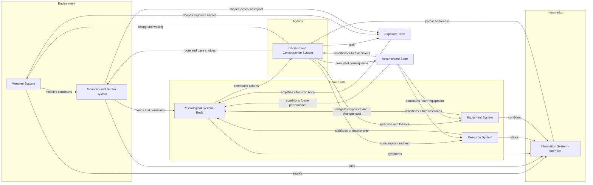
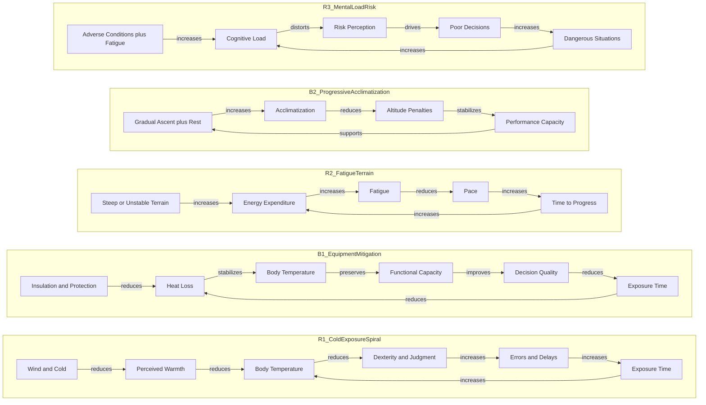

# Systemic Architecture Diagram (Mermaid)

This file contains Mermaid diagrams that render cleanly on GitHub.

## 1) Full Systems and Interactions (Overview)

## 2) Key Feedback Loops (Representative)

### Notes for GitHub
- Keep the code blocks exactly as shown: triple backticks + `mermaid`.
- Avoid parentheses in labels if you hit renderer-specific parse errors.
- Use simple subgraph identifiers (no bracketed titles) for maximum compatibility.
