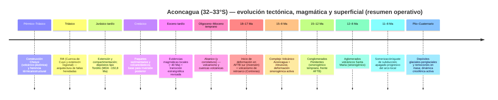

# Biblia geológica del Aconcagua para Aconcagua: Stone Sentinel

**Repositorio / archivo:** `biblia-geologica-aconcagua.md`  
**Proyecto:** *Aconcagua: Stone Sentinel*  
**Versión:** 1.0 (definitiva-operativa)  
**Actualización:** 2026-04-14 (America/Argentina/Buenos_Aires)  
**Alcance espacial (ROI):** ~32°–33°S y 70°25′–69°W (Cordillera Principal–Cordillera Frontal–Precordillera), con foco en el **macizo y cerro Aconcagua**. <!-- citeturn8view2 -->  
**Altura de referencia (cumbre Aconcagua):** 6960,8 m s. n. m. (Programa SIGMA, mediciones 2011–2012, IGN) y listado IGN 6961 m (redondeo). <!-- citeturn20search0turn20search2 -->  
**Restricciones no especificadas:** *no specific constraint* (p. ej., licencias finales de assets gráficos a incorporar al repo, escala objetivo para cartografía interna “exportable”, estándar cromático del proyecto).

## Resumen ejecutivo

El cerro Aconcagua (Cordillera Principal, Mendoza) se emplaza en un sector clave de los Andes centrales del sur: la transición entre la subducción subhorizontal pampeana (al N) y la subducción “normal” (al S), con efectos directos sobre el estilo de deformación cortical, la migración del arco magmático y el apagado del volcanismo hacia el Mioceno tardío. <!-- citeturn6search0turn6search1turn45view0turn7view1 -->

Desde el punto de vista litológico, el Aconcagua es el remanente de un **estratovolcán compuesto mioceno** (brechas, andesitas, dacitas y tobas) agrupado en el **Complejo Volcánico Aconcagua**, con una arquitectura de “sección inferior” (~13,7–11,3 Ma) y “sección superior” (~11,1–9,6 Ma) separadas por discordancia angular; el registro incluye intrusivos y diques asociados y un plutón granodiorítico temprano (Granodiorita Matienzo, ~21,6 Ma). <!-- citeturn46view0turn7view0turn34view0 -->

Estructuralmente, el área forma parte de la **Faja Plegada y Corrida del Aconcagua (AFTB)**, con participación mixta **thin-skinned** (despegues en niveles débiles mesozoicos, incluyendo evaporitas donde existan) y **thick-skinned** (inversión de estructuras extensionales heredadas y participación del basamento). Los balances de secciones publicados para el sector 33°30′–33°45′S proponen acortamientos del orden de varias decenas de km (p. ej., ~47 km en un corte representativo del AFTB sur), con migración temporal del frente de deformación y episodios fuera de secuencia. <!-- citeturn17view0turn45view0turn6search7turn38view0 -->

En superficie, la geomorfología está dominada por el modelado glaciar–periglaciar cuaternario (valles de Horcones y Vacas, morenas, glaciares cubiertos y glaciares de escombros, termokarst), con **peligros geológicos de primer orden** para operaciones y narrativa: remociones en masa (caídas, flujos de detritos, deslizamientos), colapsos/mega-deslizamientos vinculados a la pared sur, y comportamiento dinámico de glaciares (surges y termokarst) con potencial de impactos aguas abajo. <!-- citeturn27view0turn26view0turn30view0turn29view0turn28view0 -->

Para el proyecto *Stone Sentinel*, esto se traduce en un set claro de “drivers” visuales y físicos: alternancia de paquetes volcaniclásticos inclinados y alterados, intrusivos resistentes que controlan aristas y “espinazos”, estructuras de cabalgamiento (frentes Penitentes/Santa María en el corredor) y un paisaje criogénico activo (glaciares cubiertos, escombros, conos de deyección y cicatrices de remoción), todo anclado en datos abiertos de DEM/satélite (Copernicus DEM, SRTM, AW3D30, Sentinel-2). <!-- citeturn21search0turn21search1turn21search2turn21search3turn21search4turn30view0 -->

## Introducción

Este documento consolida una base técnica única (“biblia geológica”) para describir y operar con la geología del Aconcagua dentro del repositorio del proyecto, priorizando: (i) coherencia estratigráfica y tectónica, (ii) trazabilidad a mapas y literatura primaria, (iii) parámetros utilizables en modelado 3D/visualización y worldbuilding, y (iv) inventario pragmático de riesgos geológicos relevantes para logística en el corredor andino.

El área de interés se restringe a ~32°–33°S y 70°25′–69°W, incluyendo el Parque Provincial Aconcagua y el corredor Las Cuevas–Horcones–Vacas–Punta de Vacas–Polvaredas–Uspallata (como marco operativo). <!-- citeturn27view0turn22view0 -->

### Metodología y fuentes

Se siguió una metodología de síntesis con jerarquía de evidencia:

Primero se tomó como columna vertebral la monografía **Ramos et al. (1996)** (Anales 24) y sus capítulos por tema (estratigrafía, estructura, volcanismo, geomorfología). <!-- citeturn5search5turn33view0 -->  
Luego se incorporaron actualizaciones 1996–2026 con foco en: (a) **re-asignaciones cronoestratigráficas y nuevas edades U-Pb/Ar-Ar** y reinterpretaciones de unidades clave (p. ej., sección del río Cuevas), (b) **síntesis tectónicas** sobre estilo/timing del AFTB y Cordillera Frontal, (c) **geociencia aplicada** a peligros (inventarios, DInSAR, geocronología cuaternaria) y criósfera (Inventario Nacional de Glaciares, termokarst, surges). <!-- citeturn7view1turn34view0turn45view0turn28view0turn30view0turn29view0 -->

Se priorizaron fuentes en español cuando existen (RAGA, SciELO Argentina, SEGEMAR, IGN, IANIGLA) y peer-reviewed recientes (Frontiers 2023/2025, EPSL 2022, Scientific Reports 2019, Nature Communications 2026). <!-- citeturn45view0turn7view1turn34view0turn38view0turn39view0turn28view0 -->

**Limitaciones (explícitas):** parte de los PDFs pesados del repositorio DSpace de SEGEMAR (cartas y memorias) presentan timeouts desde el entorno de extracción; se incluyen igualmente las referencias oficiales y enlaces al ítem madre cuando estuvo accesible, pero se indica cuando no se pudo inspeccionar el contenido completo. <!-- citeturn12view0turn8view2 -->

**Bases de datos y catálogos (para ampliar y auditar):**  
- GeoRef (AGI) para bibliografía, mapas y tesis. <!-- citeturn25search2 -->  
- EarthChem Portal y GEOROC para geoquímica, isótopos y edades analíticas publicadas. <!-- citeturn25search0turn25search1turn25search4turn25search9 -->  
- Repositorios nacionales (Exactas-UBA, CONICET Digital) para tesis y literatura gris localizada. <!-- citeturn25search3turn44search2turn41search12 -->

**Convenciones cartográficas (recomendadas para el repo):** WGS84 geográficas y UTM Zona 19S (EPSG:32719) para capas operativas; alturas en m s. n. m.; edades en Ma. *(Si el proyecto adopta POSGAR/GK, fijar versión y faja en un `README_GIS.md` del repo.)*

## Marco geológico regional andino

### Contexto geodinámico

El Aconcagua se ubica en un tramo de los Andes centrales donde la interacción Nazca–Sudamérica presenta una fuerte segmentación latitudinal. Entre ~27° y ~33,5°S, la subducción pampeana se caracteriza por un segmento de losa subhorizontal asociado, entre otros factores, a la interacción con la Dorsal de Juan Fernández y patrones de acoplamiento/estructura de losa que influyen sobre el volcanismo y la deformación. <!-- citeturn6search0turn6search1turn6search11turn6search2turn6search12turn6search16 -->

En el entorno 33°–34°S se desarrolla una **zona de transición**: al sur se registra arco volcánico activo (desde Tupungato hacia el S), mientras que al norte disminuye/cesa el volcanismo moderno asociado al apagado del arco durante el Mioceno tardío por somerización de la losa. <!-- citeturn45view0turn7view1turn6search1turn39view0 -->

### Provincias geológicas dentro de la ROI

En términos morfoestructurales y geológicos, el recorte 32°–33°S y 70°25′–69°W incluye (de O a E, simplificado):

- **Cordillera Principal (CP):** secuencias mesozoicas y cenozoicas (sedimentarias, volcánicas y volcaniclásticas) y el núcleo de la **Faja Plegada y Corrida del Aconcagua**; aquí se inserta el edificio volcánico mioceno del Aconcagua. <!-- citeturn7view1turn46view0turn27view0 -->
- **Cordillera Frontal (CF):** bloque de basamento levantado (con Choiyoi muy representativo) y estructuras que, según modelos, tuvieron exhumación temprana (desde ~20 Ma) o bien un levantamiento dominante desde ~9–6 Ma en modelos clásicos; la discusión de vergencias y timing es parte central del estado del arte. <!-- citeturn38view0turn45view0turn31view0 -->
- **Precordillera (PC) (margen oriental del recorte):** aparece en el extremo E de la ROI (hasta 69°W), relevante en metalogenia y antepaís (según la carta 3369-I). <!-- citeturn8view2 -->

### Mapas y datos regionales recomendados

1) **Repositorio SEGEMAR – Anales 24 (Ramos et al., 1996)**: base para nombres de unidades y marco estratigráfico/estructural regional. <!-- citeturn5search5turn33view0 -->  
2) **Cartas y datasets SEGEMAR** (cuando se requiera capa geofísica/DEM/aerogamma): Hoja 3369-I *Carta Geofísica* (DTM, magnetometría, radiometría gamma; escala 1:250.000). *(Ítem accesible; descarga de sub-PDFs puede fallar según entorno.)* <!-- citeturn12view0 -->  
3) **SIGAM/GeoNetwork SEGEMAR**: capas cuaternarias y deformaciones a 250K útiles para neotectónica regional (linking desde bibliografías recientes). <!-- citeturn22view0 -->

## Estratigrafía, magmatismo y geocronología

### Principio operativo

Para el proyecto conviene manejar dos niveles simultáneos:

- **Nivel A (operativo/visual):** paquetes “basamento Choiyoi” + “Mesozoico sedimentario/volcaniclástico” + “Cenozoico volcánico-mioceno” + “Cuaternario superficial”.  
- **Nivel B (geológico estricto):** formaciones por nombre y edad (incluyendo revisiones U-Pb/Ar-Ar recientes que reubican unidades históricamente asignadas al Cretácico).

La sección del río Cuevas y alrededores ha recibido revisiones importantes: edades U-Pb y reinterpretaciones estratigráficas sugieren que varios cuerpos volcánicos previamente mapeados como “cretácicos” en el esqueleto clásico corresponden a volcanismo del Paleógeno tardío–Mioceno (Abanico/Farellones) y/o a pulsos miocenos vinculados al propio Complejo Volcánico Aconcagua. <!-- citeturn7view1turn32view3 -->

### Columna litoestratigráfica sintética (ROI 32–33°S)

> **Uso recomendado:** adoptar esta tabla como diccionario maestro de unidades (`/docs/geologia/unidades.yml`) para etiquetar mallas, texturas y assets.

| Paquete | Unidades / grupos (ejemplos dominantes en la ROI) | Edad (aprox.) | Litología / rasgos | Ambiente / significado | Señales visuales útiles (modelado) |
|---|---|---:|---|---|---|
| Basamento | Metamorfitas y sedimentitas paleozoicas inferiores + faja máfico-ultramáfica (compleja) reportada a escala de carta 3369-I | Eopaleozoico–Paleozoico inf. | Metasedimentitas, metavolcánicas, cuerpos máficos/ultramáficos | Basamento pre-andino; herencias estructurales | Afloramientos oscuros, bandas, crestas resistentes (si expuestos) |
| Gondwánico tardío | Orogenia gondwánica (estructuración pre-pérmica) | Paleozoico tardío | Deformación + intrusivos | Precondiciona anisotropías | Foliaciones/lineaciones heredadas |
| Provincia magmática Choiyoi | **Grupo Choiyoi** (volcanitas y plutonitas permo-triásicas) | ~Pérmico–Triásico inf. | Riolitas/dacitas/andesitas + granitos; gran volumen | Arco/extensión post-gondwánica | Tonos claros-rojizos, ignimbritas, coladas masivas; mesas y paredones |
| Rift de Cuyo (extensión) | Secuencia volcano-sedimentaria triásica en cuencas tipo rift (Precordillera) | Triásico | Clásticos + basaltos subordinados | Rifting; controla fallas heredadas | Estratos rojos, medio a grueso, geometrías de hemigráben |
| Mesozoico (CP) | Secuencias del Jurásico–Cretácico: calizas (p. ej., La Manga), red beds (Tordillo), unidades cretácicas (Diamante y equivalentes) y paquetes volcánicos/volcaniclásticos (históricamente “Juncal” en mapas clásicos, hoy revisados parcialmente) | Jurásico–Cretácico | Carbonatos + clásticos rojos + volcaniclásticos | Cuencas intra-arco/retroarco y transición a inversión | Alternancia caliza–rojo–volcánico; estratos con buzamientos fuertes en faja |
| Paleógeno tardío–Mioceno temprano (Chile/cordón del Límite) | **Abanico** (tobas, brechas, lavas, lacustres) y **Farellones** (volcanismo mioceno) en CP occidental; correlaciones y edades refinadas por U-Pb/Ar-Ar | Oligoceno–Mioceno temprano | Volcánico-volcaniclástico | Evolución de cuenca volcánica e inversión | Colores verdes/grises, brechas; paquetes volcánicos espesos |
| Mioceno (Aconcagua) | **Complejo Volcánico Aconcagua** + intrusivos asociados (filones, diques, pórfidos) | ~15,8–8 Ma (con núcleos 13,7–11,3 / 11,1–9,6) | Andesitas, dacitas, brechas, tobas; intrusivos | Arco expandido / migración inboard | Estratos volcaniclásticos inclinados, alteración argílica, diques resistentes |
| Mioceno sinorogénico (frontal AFTB) | Conglomerados Penitentes (15–12 Ma) y aglomerados volcánicos Santa María (12–8 Ma) como rellenos sinorogénicos (según síntesis reciente) | Mioceno medio–tardío | Conglomerados, debris flows, volcaniclásticos | Registro directo de deformación y erosión | Conos, bancos gruesos, discordancias visibles |
| Plio–Cuaternario | Depósitos glaciales, fluviales, aluviales, coluviales; caliches locales; depósitos de remoción en masa | Plio–Holoceno | Material no consolidado a semiconsolidado | Modelado reciente; peligros | Morenas, abanicos, coluviones, cicatrices y depósitos caóticos |

**Notas clave de revisión estratigráfica**  
- En el recorte 32°50′S, edades U-Pb y nueva cartografía sugieren: (i) las “Volcanitas Vargas” pertenecen al tramo basal de Diamante; (ii) “Volcanitas Laguna Seca” podrían ser una unidad informal distinta y más joven; (iii) paquetes asignados a Vaca Muerta/Mulichinco/Agrio en cartografías históricas pueden corresponder a unidades más jóvenes (Saldeño–Pircala–Coihueco) en ciertos sectores; (iv) parte de lo mapeado como “Juncal” incluye volcanismo mioceno tardío en interpretaciones recientes (se cita como línea de trabajo activa). <!-- citeturn32view3turn7view1 -->

### Geocronología y edades de referencia (tabla comparativa)

> **Uso recomendado:** esta tabla debe volcarse a un CSV versionado (`/data/geocronologia/aconcagua_geocron.csv`) para trazabilidad y para un “timeline” automático en el motor del proyecto.

| Material / unidad | Localidad / referencia | Método | Edad (Ma) | Comentario operativo |
|---|---|---|---:|---|
| Granodiorita Matienzo | Quebrada Benjamín Matienzo (área Cuevas) | K/Ar (biotita) | 21,6 ± 1,0 | Intrusivo temprano; ancla magmática previa al edificio principal. <!-- citeturn46view0turn7view0 --> |
| Roca de caja Q. Matienzo | Matienzo | K/Ar | 20,9 ± 3,0 | Edad amplia; usar como orientación, no como marcador único. <!-- citeturn46view0 --> |
| Dique Tolosa oriental | Tolosa | K/Ar (plagioclasa) | 14,3 ± 1,0 | Señala fase magmática miocena temprana-media previa/temprana del CVA. <!-- citeturn46view0 --> |
| Dacita Plaza de Mulas | Plaza de Mulas | K/Ar | 13,7 ± 1,8 | Compatible con “sección inferior” del CVA. <!-- citeturn46view0turn7view0 --> |
| Dacita (4250 m) | Flanco alto | K/Ar | 15,8 ± 0,4 | Límite mínimo “más antiguo” inferido para secuencia volcánica del Aconcagua. <!-- citeturn46view0turn7view0 --> |
| Andesitas/dacitas (sección inferior) | Varias (Berlín/Plaza de Mulas/Plataforma) | K/Ar | ~11,3–13,7 | Secuencia inferior: lavas/brechas/tobas; alteración frecuente. <!-- citeturn46view0turn7view0 --> |
| Andesita cumbre (AC-2) | Cumbre | K/Ar (hornblenda) | 9,63 ± 0,44 | Indicador de “sección superior” (cumbre). <!-- citeturn46view0turn7view0 --> |
| Andesita Canaleta | ~6800 m | K/Ar | 8,9 ± 0,5 | Interpretada como filón/actividad tardía que intruye cumbre. <!-- citeturn46view0 --> |
| Tobas Conglomerado Santa María | Santa María (sinorogénico) | K/Ar | 8,1 ± 0,6 | Relación directa con rellenos sinorogénicos y volcanismo. <!-- citeturn46view0turn34view0 --> |
| SMC (ashes) | Santa María Conglomerate (SMC) | U-Pb circón (cenizas) | ~12–11 | Depósito coetáneo con actividad volcánica y deformación. <!-- citeturn34view0 --> |
| Tordillo (MDA) | Nacientes río Blanco | U-Pb detrítico (MDA) | 150,78 ± 0,55 | Re-asigna red beds al Jurásico tardío (Tordillo) en sector revisado. <!-- citeturn32view1 --> |
| Magmatismo “lull” eoceno | Sill con U-Pb ~40 Ma (mencionado en síntesis) | U-Pb circón | ~40 | Evidencia local de magmatismo eoceno; importante para narrativa de “episodios” del arco. <!-- citeturn32view3turn34view0 --> |
| Exhumación Cordillera Frontal (33,5°S, marco regional) | Perfil de termocronología | AHe/ZHe | inicio ~20 (cota máx ~22; seguro <14) | Relevante para discusión de vergencias y timing del crecimiento andino. <!-- citeturn38view0 --> |

### Volcanismo y magmatismo mioceno del Aconcagua (síntesis)

El volcanismo del Aconcagua se interpreta como un episodio de arco andesítico-dacítico de gran volumen durante el Mioceno medio en estas latitudes. Las edades K/Ar compiladas para la cumbre y alrededores definen:

- **Sección inferior:** probable ~13,7 a 11,3 Ma (lavas, brechas y tobas andesíticas/dacíticas) y presencia de cuerpos hipabisales asociados.  
- **Sección superior:** ~11,1 a 9,6 Ma (tobas, flujos piroclásticos y lavas), con paquetes inclinados y una discordancia angular que sugiere episodios de deformación o basculamiento durante la construcción. <!-- citeturn46view0turn7view0 -->

La geoquímica/lectura regional vincula este pulse con la migración del arco y el engrosamiento cortical, y su cese hacia el Mioceno tardío se asocia a cambios en geometría de subducción (somerización) y migración del locus tectónico hacia el antepaís. <!-- citeturn6search1turn7view1turn39view0 -->

## Estructura y tectónica

### Arquitectura general de la Faja Plegada y Corrida del Aconcagua (AFTB)

En el corredor Aconcagua–Cuevas–Vacas, el AFTB se organiza como un sistema de cabalgamientos y pliegues con dominios frontal/interno y participación variable de despegues en niveles mesozoicos. En el sector revisado 32°50′S se destacan como estructuras mayores del frente: **corrimiento Penitentes** y **corrimiento Santa María**, con relaciones claras entre depósitos miocenos (Penitentes y Santa María) y actividad de estructuras. <!-- citeturn7view1turn32view0turn32view2 -->

La estratigrafía mesozoica preserva señales de extensión jurásica (hemigrábenes y cambios de espesor/facies) que controlan la geometría posterior de inversión y el estilo mixto thin/thick-skinned. <!-- citeturn32view0turn17view0 -->

### Magnitud de acortamiento y secciones restauradas (valores guía)

- En un corte sintético representativo del sector 33°30′–33°45′S, la restauración indica **acortamiento total ~47 km** (≈57% de la longitud original del tramo balanceado), con partición fuerte en el dominio thin-skinned y menor en dominios thick-skinned. <!-- citeturn17view0 -->
- Modelos regionales de transición flat–normal subduction y reevaluaciones de estructura/kinemática a ~33,5°S reportan rangos de **acortamiento avanzados del orden de decenas de km (≈31–55 km)** según geometría adoptada y supuestos de despegue y participación de basamento. <!-- citeturn41search1turn38view0 -->

> **Uso operativo en el proyecto:** para reconstrucción 3D y narrativa, trabajar con un rango “robusto” de **~35–55 km** de acortamiento acumulado para el segmento CP–CF en el entorno 33°S, y mantener explícita la sensibilidad al modelo (thin-skinned dominante vs participación temprana del basamento). Este rango es consistente con balances publicados y discusiones recientes sobre crecimiento no estrictamente “in-sequence” hacia el E. <!-- citeturn17view0turn45view0turn38view0 -->

### Timing de deformación: modelo clásico vs revisiones recientes

**Modelo clásico (síntesis tipo cuña crítica y avance hacia el antepaís):**  
En el sector sur del AFTB (33°30′–33°45′S), se propone inicio de deformación ~18–17 Ma por inversión de fallas extensionales; migración hacia el E durante Mioceno medio involucrando secuencias mesozoicas; y levantamiento de Cordillera Frontal desde ~9 Ma hasta ~6 Ma (cambios de paleocorrientes, discordancias en unidades sinorogénicas, clastos proximales). Luego existiría deformación continuada y fuera de secuencia hasta ~4 Ma, con cobertura discordante por volcanitas plio-pleistocenas como marcador post-tectónico regional. <!-- citeturn45view0turn17view0 -->

**Revisiones/controversia moderna (exhumación temprana y vergencias):**  
Termocronología (AHe/ZHe) sobre basamento de Cordillera Frontal a ~33,5°S sugiere exhumación continua iniciando **~20 Ma** (y en cualquier caso antes de ~12–14 Ma), lo que tensiona el paradigma de “levantamiento tardío” estrictamente posterior al desarrollo del AFTB, y alimenta modelos donde parte del crecimiento ocurre sobre estructuras de basamento y/o con vergencia no puramente al E. <!-- citeturn38view0turn7view1 -->

**Síntesis 2026 (marco integrador de episodios):**  
Una síntesis amplia de cronología y geoquímica del arco cenozoico propone que la **migración inboard del arco** tiende a preceder episodios de avance de la deformación retroarco en escalas <10 Ma, mediante debilitamiento y acople fluido-asistido sobre la losa. Aunque es una síntesis regional (no exclusiva del Aconcagua), es coherente con el patrón mioceno de expansión del arco y reorganización del frente tectónico en el segmento 31–33°S. <!-- citeturn39view0turn7view1 -->

### Timeline tectónico-magmático (Mermaid)



Modelo y edades apoyados en compilaciones (volcanismo 1996), U-Pb recientes, síntesis estructural/termocronológica y marco 2026. <!-- citeturn46view0turn32view1turn34view0turn45view0turn38view0turn39view0 -->

### Figuras y secciones estructurales (mínimo requerido para el repo)

**Figura propuesta (obligatoria para tener una “sección bandera” en el proyecto):**

 <!-- citeturn45view0turn17view0 -->

**Diagrama esquemático adicional (Mermaid, para documentación rápida):**

```mermaid
flowchart LR
    W[Oeste (Chile)\nWest Andean FTB / Abanico-Farellones] --> EFZ[Zona de fallas El Fierro\n(límite occidental)]
    EFZ --> AFTB[Faja Plegada y Corrida del Aconcagua\n(thin + thick skinned)]
    AFTB --> PT[Corrimiento Penitentes\n(frente thin-skinned)]
    PT --> FC[Cordillera Frontal\n(basamento + Choiyoi)\nlevantamiento/exhumación]
    FC --> PC[Precordillera / antepaís\n(margen E de la ROI)]
```

Relaciones de dominios y frentes según síntesis recientes de la sección Cuevas y balances publicados. <!-- citeturn7view1turn32view0turn45view0turn17view0 -->

## Geomorfología, glaciación y riesgos geológicos

### Geomorfología glaciar–periglaciar

El Parque Provincial Aconcagua y su área de amortiguación (valles Horcones–Vacas) exhiben un paisaje fuertemente condicionado por glaciaciones pleistocenas y procesos fríos actuales (crioclastismo, permafrost de montaña, glaciares cubiertos y glaciares de escombros). <!-- citeturn27view0turn28view0turn31view0 -->

En la pared sur del Aconcagua, los glaciares colgantes y los sistemas asociados (Horcones Superior/Inferior, Polacos, etc.) constituyen elementos claves tanto hidrológicos como de peligrosidad; el Inventario Nacional de Glaciares para subcuencas Cuevas–Vacas provee un baseline metodológico/definicional (Ley 26.639) y cartografía asociada. <!-- citeturn28view0turn4search8turn4search19 -->

### Dinámica criosférica relevante: surges y termokarst

El glaciar Horcones Inferior presenta historial de **surges** (p. ej., 1985, 2003–2006) y desarrollo de termokarst; se han estimado porcentajes de termokarst variables (~4,3% a 0% de la superficie del glaciar al finalizar un surge) y velocidades superficiales promedio desde ~0,4 a 12 m/día en periodos analizados, usando series Landsat/ASTER. <!-- citeturn30view0 -->

Modelos estructurales aplicados a la deformación del surge 1985 interpretan un estilo de fallamiento extensional interno tipo “domino/rotacional” y cuantifican avances del frente (p. ej., ~1,55 km en el evento analizado) junto con cambios de espesor. <!-- citeturn29view0 -->

### Remociones en masa y mega-eventos

Un inventario geomorfológico en el Parque Provincial Aconcagua identificó **~400 eventos** de remoción en masa (caídas, flujos de detritos, deslizamientos y eventos complejos), interpretando **~89%** como activos con potencial de reactivación; en términos areales se reporta alta incidencia de flujos de detritos, con control por litología, pendiente, crioclastismo y debilidades estructurales. <!-- citeturn27view0 -->

La pared sur del Aconcagua y depósitos asociados (Horcones/Almacenes) han sido reinterpretados incorporando hipótesis de **mega-deslizamientos/rock avalanches** y rellenos complejos, con recomendaciones explícitas de monitoreo continuo de glaciares colgados y surges por potencial de eventos extremos (baja frecuencia, alto impacto). <!-- citeturn26view0 -->

### Peligro sísmico y neotectónica operativa del corredor

El sector norte de Mendoza es clasificado como de alta peligrosidad sísmica por el esquema nacional (INPRES), y aunque el margen occidental de la Cordillera Frontal cerca de Mendoza puede mostrar baja sismicidad en periodos largos, existen episodios como el **enjambre sísmico de Punta de Vacas (jun–jul 2019, Mw ~2,7–3,9)** alineado con un lineamiento (Las Vacas), relevante para infraestructura y operación del corredor RN7. <!-- citeturn22view0 -->

### Tabla operativa de riesgos (para planificación, narrativa y assets)

| Proceso | Dónde es crítico en la ROI | Disparadores típicos | Indicadores / datos | Recomendación para el repo (assets/capas) |
|---|---|---|---|---|
| Caídas de roca | Paredones, estratos con alto buzamiento, gargantas (Horcones/Cuevas) | Criofractura, sismos, desconfinamiento postglacial | Inventarios geomorfológicos y cicatrices | Capa `rockfall_sources.geojson` + texturas de detritos. <!-- citeturn27view0turn22view0 --> |
| Flujos de detritos | Conos y quebradas tributarias, valles Horcones/Vacas | Deshielo, tormentas, termokarst/surge | Alta frecuencia (inventario) | Capa `debris_flow_paths.geojson` + máscara de abanicos. <!-- citeturn27view0turn30view0 --> |
| Deslizamientos / eventos complejos | Laderas inestables postglaciales | Saturación + debilidades litológicas/estructurales | Depósitos y endicamientos históricos | `landslide_inventory.geojson` + “story beats” de endicamientos. <!-- citeturn27view0 --> |
| Mega-rockslides / avalanchas de roca | Pared sur y rellenos Horcones/Cuevas | Debutressing glacial + sismos + litología | Depósitos masivos, morfologías caóticas | Asset “set piece” geológico + capa `mega_events_polygons`. <!-- citeturn26view0turn30view0 --> |
| Surges glaciares | Horcones Inferior | Hidrología subglacial, deformación interna, clima | Modelos, series satelitales | Serie temporal (Landsat/ASTER/Sentinel) + layer `glacier_dynamics`. <!-- citeturn29view0turn30view0 --> |
| Sismicidad local (enjambres) | Punta de Vacas / lineamientos | Mecanismos no resueltos (posible control estructural) | Eventos relocalizados y mecanismos focales | Capa `seismic_swarm_2019.geojson` + narrativa “alertas”. <!-- citeturn22view0 --> |

## Recursos minerales e implicancias para el proyecto

### Recursos minerales y metalogenia (síntesis por metalotectos)

La **Carta Minero-Metalogenética 3369-I Cerro Aconcagua** (SEGEMAR) cubre 32°–33°S y 69°–límite con Chile, incluyendo Precordillera–Cordillera Frontal–Cordillera Principal, y resume metalotectos litológicos y estructurales desde el basamento eopaleozoico hasta el magmatismo ándico. Entre sus conclusiones: reconocimiento de fajas metalogenéticas (p. ej., baritina estratiforme en plataforma paleozoica tardía; depósitos tipo pórfiro ligados a eventos gondwánicos y ándicos; mantos cupríferos jurásicos; epitermales y sistemas de transición polimetálicos) y mención de que, a la fecha, **San Jorge (pórfiro pérmico)** cuenta con reservas probadas dentro del ámbito de carta. <!-- citeturn8view2 -->

> **Uso operativo:** en *Stone Sentinel*, los recursos minerales sirven tanto para “lore” (rutas, campamentos, ruinas industriales, conflictos) como para texturizado (alteración hidrotermal, gossans, vetas) y para justificar planificación de exploración histórica en el corredor.

**Checklist mínimo sugerido (assets del repo):**
- `assets/geologia/alteracion_hidrotermal_palette.png` (argílica avanzada, propilítica, silicificación).  
- `data/mineria/ocurrencias_minerales_3369I.geojson` (digitalización desde carta SEGEMAR si se obtiene el PDF de mapa).  
- `docs/mineria/metalogenia_resumen.md` (derivado, sin crear “sección nueva” aquí: solo como archivo auxiliar si el proyecto lo requiere).

### Implicancias para Aconcagua: Stone Sentinel (arte, worldbuilding, modelado)

**Fuentes DEM y satélite (base “sin excusas”):**  
- Copernicus DEM GLO-30 (DSM ~30 m; acceso vía Copernicus Data Space / Sentinel Hub). <!-- citeturn21search0turn21search4 -->  
- SRTM (global, void-filled; referencia USGS/NASA). <!-- citeturn21search1turn21search9 -->  
- ALOS AW3D30 (DSM ~30 m, JAXA). <!-- citeturn21search2turn21search14 -->  
- Sentinel-2 (multiespectral, SR Level-2A). <!-- citeturn21search3turn21search11turn21search15 -->

**Recomendación de pipeline (pragmática):**
1) Generar DEM base (Copernicus GLO-30) y derivados: pendiente, curvatura, rugosidad, sombreado multiazimuth. <!-- citeturn21search0turn21search4 -->  
2) Mapear “unidades visuales” por litopacks (Choiyoi / mesozoico / volcaniclásticos miocenos / cuaternario) con masks manuales guiadas por mapas y por firmas espectrales (Sentinel-2). <!-- citeturn21search3turn7view1turn46view0 -->  
3) Incorporar “estructuras dominantes” como líneas maestras (Penitentes thrust, dominios AFTB) que controlen valles y frentes de escarpa. <!-- citeturn7view1turn45view0 -->  
4) Incorporar criósfera y peligros como capas vivas: glaciares (inventario), termokarst, conos de detritos, cicatrices; usar series temporales para storytelling (p. ej., surge 2003–2006). <!-- citeturn28view0turn30view0turn27view0 -->

**“Lecturas” geológicas convertibles a decisiones artísticas:**
- Diques/filones andesítico-dacíticos como “huesos” resistentes (crestas y espolones) que sobreviven a la meteorización del volcaniclástico alterado. <!-- citeturn46view0 -->  
- Alteración hidrotermal (argílica avanzada, silicificación) como “zonas blanqueadas” de alto contraste cromático, útiles para guiar rutas, hitos y peligros (derrumbes). <!-- citeturn46view0turn8view2 -->  
- Depósitos caóticos de mega-eventos (Horcones) como set pieces narrativas (catástrofes antiguas) y como control geomorfológico (valles rellenos, cambios de pendiente). <!-- citeturn26view0 -->  

### Conclusiones operativas

El Aconcagua es mejor modelado y explicado como un sistema geológico integrado: **edificio volcánico mioceno** (CVA) construido durante un pulso de arco expandido, emplazado y preservado dentro de una **faja plegada y corrida** con herencia extensional mesozoica y participación variable del basamento, cuya evolución se vincula a cambios en la **geometría de subducción** y a migraciones episódicas del arco y del frente tectónico. <!-- citeturn46view0turn7view1turn45view0turn6search1turn39view0 -->

En superficie, los procesos glaciares-periglaciares y las remociones en masa no son “ruido”: son el principal motor actual del relieve y del riesgo, y deben figurar explícitamente como capas en el repositorio (inventarios, masks, y sets narrativos). <!-- citeturn27view0turn26view0turn30view0turn28view0 -->

### Bibliografía completa (APA)

Accotto, C., et al. (2022). *A review of U-Pb detrital zircon systematics…* Geogaceta, 71, 67–70. <!-- citeturn15search23 -->

Carrapa, B., DeCelles, P. G., Ducea, M. N., et al. (2022). Estimates of paleo-crustal thickness at Cerro Aconcagua (Southern Central Andes) from detrital proxy-records: Implications for models of continental arc evolution. *Earth and Planetary Science Letters, 585*, 117526. <!-- citeturn34view0 -->

Capaldi, T. N., Horton, B. K., Mackaman-Lofland, C., Fuentes, F., et al. (2026). Inboard advance of arc magmatism regulates mountain building in the Andes. *Nature Communications* (Open Access), publicado 11/04/2026. <!-- citeturn39view0 -->

Cristallini, E. O., & Ramos, V. A. (2000). Thick-skinned and thin-skinned thrusting in the La Ramada fold and thrust belt… *Tectonophysics*. <!-- citeturn6search7 -->

Díaz Zapata, A. T., Spagnotto, S., & Mescua, J. (2025). Seismic swarm at Punta de Vacas, Frontal Cordillera of Mendoza: Analysis of the June–July 2019 seismic events. *Revista de la Asociación Geológica Argentina, 82*(4), 412–420. <!-- citeturn22view0 -->

EarthChem. (s. f.). *EarthChem Home / Portal*. Repositorio y portal de datos geoquímicos. <!-- citeturn25search0turn25search4 -->

Fauqué, L., Hermanns, R., Hewitt, K., Rosas, M., Wilson, C., Baumann, V., Lagorio, S., & Di Tommasso, I. (2009). La pared sur del cerro Aconcagua y los depósitos asignados a los drift Almacenes y Horcones. *Revista de la Asociación Geológica Argentina, 65*(4), 692–710. <!-- citeturn26view0 -->

Fennell, L. M., et al. (2023). The classical Cuevas River section revisited: An update to the style and timing of deformation of the Aconcagua region based on new geological, structural and geochronological data (32°50′S). *Frontiers in Earth Science*. <!-- citeturn7view1turn32view1turn32view3 -->

Gans, C. R., Beck, S. L., Zandt, G., et al. (2011). Continental and oceanic crustal structure of the Pampean flat slab… *Geophysical Journal International, 186*(1), 45–58. <!-- citeturn6search12 -->

Gao, Y., et al. (2021). Impact of the Juan Fernandez Ridge on the Pampean Flat Slab. *Geophysical Research Letters*. <!-- citeturn6search11turn6search19 -->

Giambiagi, L. B. (2003). Deformación cenozoica de la faja plegada y corrida del Aconcagua y Cordillera Frontal: entre los 33°30′ y 33°45′S. *Revista de la Asociación Geológica Argentina, 58*(1), 85–96. <!-- citeturn45view0 -->

Giambiagi, L. B., & Ramos, V. A. (2002). Structural evolution of the Andes in a transitional zone between flat and normal subduction (33°30′–33°45′S), Argentina and Chile. *Journal of South American Earth Sciences, 15*(1), 101–116. <!-- citeturn41search4turn17view0 -->

Haddon, A., Wagner, L. S., Beck, S., et al. (2018). S-Wave Receiver Function Analysis of the Pampean Flat Slab. *Geochemistry, Geophysics, Geosystems*. <!-- citeturn6search2 -->

IANIGLA. (s. f.). *Inventario Nacional de Glaciares* (sitio institucional). <!-- citeturn4search8 -->

IANIGLA / Ministerio de Ambiente (Argentina). (2018). *Informe final: subcuencas de los ríos de Las Cuevas y de Las Vacas* (Inventario Nacional de Glaciares, nivel 1). <!-- citeturn28view0 -->

IGN (Instituto Geográfico Nacional, Argentina). (s. f.). Se dio a conocer la nueva altura oficial del Cerro Aconcagua (6960,8 m). <!-- citeturn20search0 -->

IGN (Instituto Geográfico Nacional, Argentina). (s. f.). *Alturas y depresiones máximas (Datos Argentina): Cerro Aconcagua (6961 m) y coordenadas*. <!-- citeturn20search2 -->

JAXA. (s. f.). *ALOS World 3D – 30m (AW3D30) dataset*. <!-- citeturn21search2turn21search14 -->

Lenzano, M. G., Trombotto Liaudat, D., & Leiva, J. C. (2012). Monitoreo del glaciar Horcones inferior y sus termokarst, antes y durante el surge de 2003–2006: Andes centrales argentinos. *Geoacta, 37*(2). <!-- citeturn30view0 -->

Linkimer, L., et al. (2025). Shape and deformation of the Pampean flat slab in Argentina (modelo de geometría local). <!-- citeturn6search16 -->

Makopoulou, E., et al. (2025). Glacial and periglacial landforms and their recent dynamics in the Las Veguitas catchment, Cordillera Frontal of the Andes (Argentina). *Frontiers in Earth Science*. <!-- citeturn31view0 -->

Milana, J. P. (2007). A model of the Glaciar Horcones Inferior surge, Aconcagua region, Argentina. *Journal of Glaciology, 53*(183). <!-- citeturn29view0 -->

Moreiras, S. M., Lenzano, M. G., & Riveros, N. (2008). Inventario de procesos de remoción en masa en el Parque Provincial Aconcagua, provincia de Mendoza – Argentina. *Multequina, 17*(2). <!-- citeturn27view0 -->

Ramos, V. A., Cristallini, E. O., & Pérez, D. J. (2002). The Pampean flat-slab of the Central Andes. *Journal of South American Earth Sciences, 15*(1), 59–78. <!-- citeturn6search1turn6search10 -->

Ramos, V. A., Aguirre-Urreta, M. B., Alvarez, P. P., Cegarra, M. I., Cristallini, E. O., Kay, S. M., Lo Forte, G. L., Pereyra, F. X., & Pérez, D. J. (1996). *Geología de la región del Aconcagua, provincias de San Juan y Mendoza* (Anales 24). Dirección Nacional del Servicio Geológico / Subsecretaría de Minería de la Nación. <!-- citeturn5search5 -->

Ramos, V. A., Kay, S. M., & Pérez, D. J. (1996). El volcanismo de la región del Aconcagua (cap. 10). En V. A. Ramos et al., *Geología de la región del Aconcagua…* (Anales 24), 297–316. <!-- citeturn46view0turn33view0 -->

Riesner, M., Simoes, M., Carrizo, D., & Lacassin, R. (2019). Early exhumation of the Frontal Cordillera (Southern Central Andes) and implications for Andean mountain-building at ~33.5°S. *Scientific Reports, 9*, 7972. <!-- citeturn38view0 -->

Rubinstein, N. A., Jara, A., Gómez, A. L. R., Pagnanini, F., Peroni, J., & Di Tommasso, I. (2022). *Carta Minero-Metalogenética 3369-I Cerro Aconcagua* (Boletín Nº 449). SEGEMAR. <!-- citeturn8view2 -->

SEGEMAR (Servicio Geológico Minero Argentino). (2002). *Carta Geofísica, Hoja 3369-I Cerro Aconcagua* (incluye DTM, magnetometría y radiometría gamma). Repositorio SEGEMAR. <!-- citeturn12view0 -->

USGS. (2018). *USGS EROS Archive – Digital Elevation: SRTM 1 Arc-Second Global* (descripción del dataset). <!-- citeturn21search1turn21search17 -->

Copernicus Data Space / ESA. (s. f.). *Copernicus DEM (GLO-30/GLO-90) – colección y condiciones de acceso*. <!-- citeturn21search0turn21search4 -->

ESA. (s. f.). *Sentinel-2 Mission / Level-2A products*. <!-- citeturn21search15turn21search11 -->

Villarroel, C. D., et al. (2018). DInSAR for a regional inventory of active rock glaciers… *Remote Sensing, 10*(10), 1588. <!-- citeturn4search10 -->

Olivar, J. A., et al. (2022). Controls on crustal seismicity segmentation on a local scale in the Southern Central Andes. *Journal of South American Earth Sciences, 116*, 103778. <!-- citeturn41search15 -->
