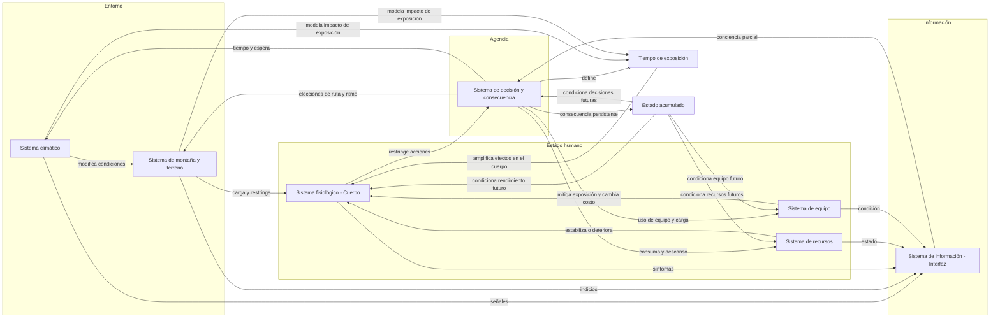
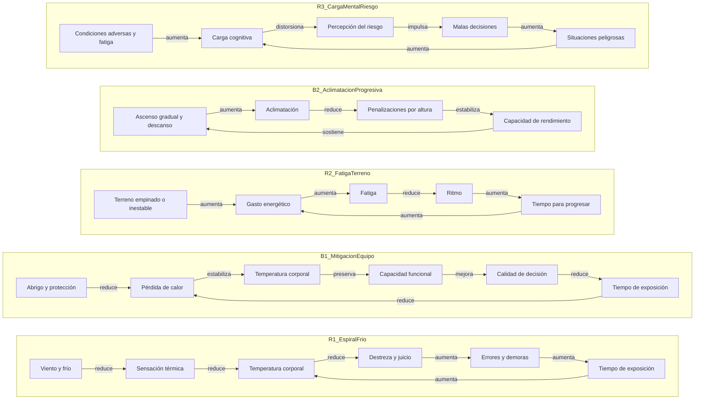

# Diagrama de Arquitectura Sistémica

## 1) Sistemas e Interacciones (Vista general)

```mermaid
flowchart LR
  %% =========================
  %% Aconcagua: Stone Sentinel
  %% Arquitectura Sistémica
  %% =========================

  %% --- Clústeres de subsistemas ---
  subgraph ENTORNO[Entorno]
    direction TB
    CLIMA[Sistema climático];
    MONTAÑA[Sistema de montaña y terreno];
  end

  subgraph HUMANO[Estado humano]
    direction TB
    CUERPO[Sistema fisiológico - Cuerpo];
    RECURSOS[Sistema de recursos];
    EQUIPO[Sistema de equipo];
  end

  subgraph INFO[Información]
    direction TB
    INTERFAZ[Sistema de información - Interfaz];
  end

  subgraph AGENCIA[Agencia]
    direction TB
    DECISION[Sistema de decisión y consecuencia];
  end

  %% --- Variables de acoplamiento ---
  EXPOSICION[Tiempo de exposición];
  ESTADO[Estado acumulado];

  %% --- Interacciones núcleo ---
  CLIMA -->|modifica condiciones| MONTAÑA;
  MONTAÑA -->|carga y restringe| CUERPO;

  %% --- Mediación / mitigación ---
  EQUIPO -->|mitiga exposición y cambia costo| CUERPO;
  RECURSOS -->|estabiliza o deteriora| CUERPO;

  %% --- Integración en la decisión ---
  CUERPO -->|restringe acciones| DECISION;
  DECISION -->|elecciones de ruta y ritmo| MONTAÑA;
  DECISION -->|tiempo y espera| CLIMA;
  DECISION -->|consumo y descanso| RECURSOS;
  DECISION -->|uso de equipo y carga| EQUIPO;
  DECISION -->|define| EXPOSICION;

  %% --- Exposición como amplificador ---
  CLIMA -->|modela impacto de exposición| EXPOSICION;
  MONTAÑA -->|modela impacto de exposición| EXPOSICION;
  EXPOSICION -->|amplifica efectos en el cuerpo| CUERPO;

  %% --- Flujos de información (señales, no certeza) ---
  CLIMA -->|señales| INTERFAZ;
  MONTAÑA -->|indicios| INTERFAZ;
  CUERPO -->|síntomas| INTERFAZ;
  RECURSOS -->|estado| INTERFAZ;
  EQUIPO -->|condición| INTERFAZ;

  INTERFAZ -->|conciencia parcial| DECISION;

  %% --- Persistencia en el tiempo ---
  DECISION -->|consecuencia persistente| ESTADO;
  ESTADO -->|condiciona rendimiento futuro| CUERPO;
  ESTADO -->|condiciona recursos futuros| RECURSOS;
  ESTADO -->|condiciona equipo futuro| EQUIPO;
  ESTADO -->|condiciona decisiones futuras| DECISION;
```

## 2) Bucles de Retroalimentación (Representativos)

```mermaid
flowchart LR
  %% =========================
  %% Bucles clave
  %% =========================

  %% R1 - Espiral de exposición al frío - Reforzante
  subgraph R1_EspiralFrio
    direction LR
    R1a[Viento y frío];
    R1b[Sensación térmica];
    R1c[Temperatura corporal];
    R1d[Destreza y juicio];
    R1e[Errores y demoras];
    R1f[Tiempo de exposición];

    R1a -->|reduce| R1b;
    R1b -->|reduce| R1c;
    R1c -->|reduce| R1d;
    R1d -->|aumenta| R1e;
    R1e -->|aumenta| R1f;
    R1f -->|aumenta| R1c;
  end

  %% B1 - Mitigación por equipo - Balance
  subgraph B1_MitigacionEquipo
    direction LR
    B1a[Abrigo y protección];
    B1b[Pérdida de calor];
    B1c[Temperatura corporal];
    B1d[Capacidad funcional];
    B1e[Calidad de decisión];
    B1f[Tiempo de exposición];

    B1a -->|reduce| B1b;
    B1b -->|estabiliza| B1c;
    B1c -->|preserva| B1d;
    B1d -->|mejora| B1e;
    B1e -->|reduce| B1f;
    B1f -->|reduce| B1b;
  end

  %% R2 - Fatiga y terreno - Reforzante
  subgraph R2_FatigaTerreno
    direction LR
    R2a[Terreno empinado o inestable];
    R2b[Gasto energético];
    R2c[Fatiga];
    R2d[Ritmo];
    R2e[Tiempo para progresar];

    R2a -->|aumenta| R2b;
    R2b -->|aumenta| R2c;
    R2c -->|reduce| R2d;
    R2d -->|aumenta| R2e;
    R2e -->|aumenta| R2b;
  end

  %% B2 - Aclimatación progresiva - Balance
  subgraph B2_AclimatacionProgresiva
    direction LR
    B2a[Ascenso gradual y descanso];
    B2b[Aclimatación];
    B2c[Penalizaciones por altura];
    B2d[Capacidad de rendimiento];

    B2a -->|aumenta| B2b;
    B2b -->|reduce| B2c;
    B2c -->|estabiliza| B2d;
    B2d -->|sostiene| B2a;
  end

  %% R3 - Carga mental y percepción de riesgo - Reforzante
  subgraph R3_CargaMentalRiesgo
    direction LR
    R3a[Condiciones adversas y fatiga];
    R3b[Carga cognitiva];
    R3c[Percepción del riesgo];
    R3d[Malas decisiones];
    R3e[Situaciones peligrosas];

    R3a -->|aumenta| R3b;
    R3b -->|distorsiona| R3c;
    R3c -->|impulsa| R3d;
    R3d -->|aumenta| R3e;
    R3e -->|aumenta| R3b;
  end
```
